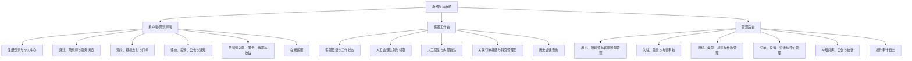
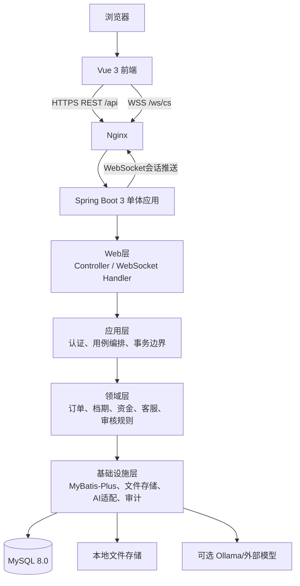
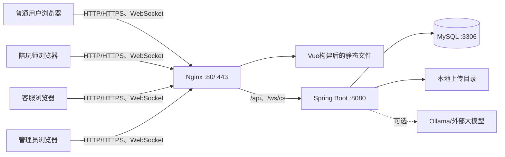
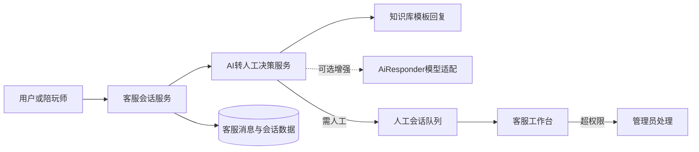
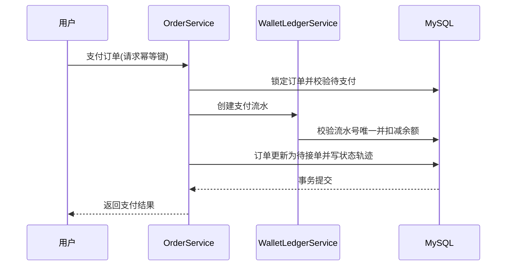
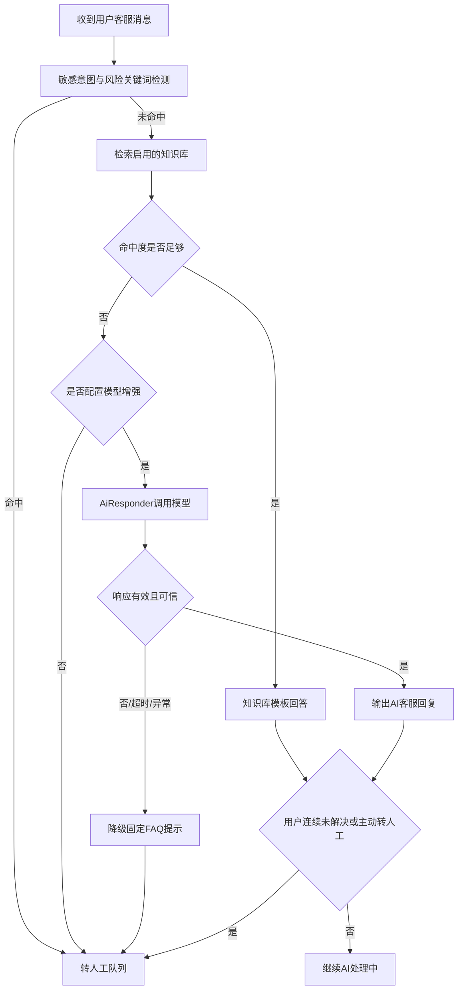
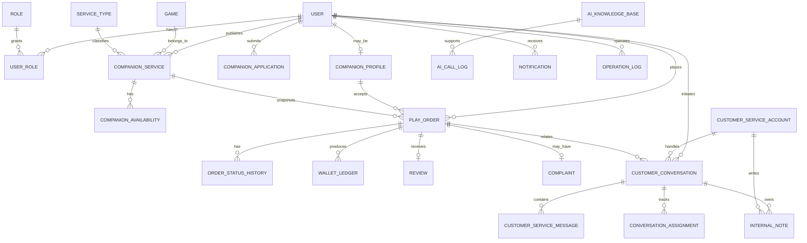

# 游戏陪玩系统概要设计说明书

> 文档版本：V1.0
> 项目名称：游戏陪玩系统
> 产品形态：Web 端 B/S 系统
> 项目性质：软件工程专业本科毕业设计
> 设计依据：《需求分析说明书》V1.1
> 编写日期：2026 年 8 月 11 日

## 1. 引言

### 1.1 编写目的

本文档在《需求分析说明书》V1.1 的基础上，对游戏陪玩系统进行概要设计，确定系统架构、技术选型、功能模块边界、核心业务机制、数据实体关系、接口分组、权限控制和部署方式，为后续数据库详细设计、接口详细设计、页面原型、编码实现和测试用例编写提供统一依据。

概要设计关注“系统由哪些部分组成、各部分如何协作、关键规则如何落地”，不展开数据表的全部字段类型、接口请求参数和具体类方法；上述内容留待详细设计阶段确定。

### 1.2 设计依据

1. 《需求分析说明书》V1.1。
2. 系统为 Web 端 B/S 架构的 C2C 多游戏陪玩平台。
3. 系统角色包括游客、普通用户、陪玩师、客服人员和管理员。
4. 首期采用模拟支付和虚拟余额，不接入真实支付、提现、语音房、直播及用户与陪玩师之间的站内私信。
5. 首期支持 AI 客服自动应答和人工客服接待，AI 在无法可靠回答、命中敏感事项或用户主动要求时转人工。

### 1.3 术语说明

| 术语 | 说明 |
|---|---|
| B/S | 浏览器/服务器架构，用户通过浏览器访问系统 |
| RBAC | 基于角色的访问控制模型，通过“用户—角色—权限”控制操作范围 |
| 陪玩服务 | 陪玩师针对某款游戏发布的开黑陪伴、娱乐陪玩或游戏教学服务 |
| 档期 | 陪玩师可接受预约的时间段，以及被有效订单占用的时间段 |
| 模拟支付 | 使用系统虚拟余额完成订单支付，仅用于毕业设计演示，不涉及真实资金 |
| 客服会话 | 用户或陪玩师与 AI 客服、人工客服之间的文本咨询通道，不等同于用户与陪玩师私信 |
| AI 知识库 | 由平台维护的常见问题、关键词和标准答案集合，用于 AI 客服优先检索和生成回复 |
| 幂等 | 同一业务请求被重复提交时，系统只产生一次有效结果 |

## 2. 总体设计

### 2.1 设计目标

1. 实现用户预约、模拟支付、陪玩师接单与履约、确认完成、评价投诉的完整闭环。
2. 保证订单、虚拟余额和收益变动的一致性、可追溯性和防重复执行能力。
3. 通过 RBAC 和数据范围校验保证客服、陪玩师和管理员仅访问授权数据。
4. 建设可离线演示的知识库优先 AI 客服，并支持稳定地转接人工客服。
5. 使用适合本科毕业设计的单体式架构，减少部署依赖和运维复杂度，同时保留后续扩展边界。

### 2.2 设计原则

| 原则 | 设计体现 |
|---|---|
| 需求可追溯 | 模块及接口按 FR 编号分组，核心 P0 功能均有对应设计组件 |
| 单体优先 | 后端使用单个 Spring Boot 应用，避免首期引入微服务、消息队列和分布式缓存集群 |
| 业务一致性优先 | 支付、退款、结算、接单和状态变更使用 MySQL 事务、唯一约束和状态前置校验 |
| 最小权限 | 所有接口在后端执行认证、角色和数据范围三层校验，不依赖前端隐藏按钮 |
| 可降级 | AI 服务异常时降级到固定 FAQ 与转人工，不能影响订单主流程 |
| 隐私最小化 | AI 仅取得回答问题所需的脱敏业务摘要，不取得密码、验证码和无关个人数据 |
| 可测试 | 订单、客服会话均以明确状态机驱动，关键写操作保留审计和状态轨迹 |

### 2.3 技术选型

| 层级 | 技术方案 | 选型说明 |
|---|---|---|
| 前端 | Vue 3、TypeScript、Vite、Vue Router、Pinia、Element Plus | 组件化开发，适合用户端、客服工作台和管理后台共用同一前端工程并按路由分区 |
| 后端 | Java 17、Spring Boot 3 | 提供 REST API、认证授权、事务管理、WebSocket 和模块化业务能力 |
| 持久层 | MyBatis-Plus | 简化基础 CRUD、分页和条件查询，复杂订单逻辑使用自定义 SQL 或 Mapper 方法 |
| 数据库 | MySQL 8.0 | 保存业务主数据、订单、流水、客服会话和审计日志；单机部署易于演示 |
| 认证授权 | Spring Security、JWT、RBAC | 无状态接口认证；令牌版本号支持禁用账号或重置密码后强制失效 |
| 实时通信 | Spring WebSocket | 用于客服文本会话、会话状态变更和新消息通知；不用于用户与陪玩师私信 |
| 文件存储 | 本地文件系统 | 保存头像、段位证明和投诉证据；通过存储接口预留 MinIO/对象存储替换能力 |
| AI 客服 | `AiResponder` 可插拔适配层 | 默认知识库模板回复可离线演示；可选接入 Ollama 或外部大模型增强回答 |
| 反向代理 | Nginx | 托管 Vue 静态文件，并代理 REST API 和 WebSocket 连接 |
| 构建与测试 | Maven、JUnit 5、Spring Boot Test、Vue 前端测试工具 | 支持单元测试、集成测试和答辩演示构建 |

### 2.4 系统边界与架构风格

系统采用“**前后端分离 + 模块化单体后端**”风格。

- 一个 Vue 前端工程按路由拆分为用户端、陪玩师端、客服工作台和管理后台。
- 一个 Spring Boot 后端工程按业务模块拆分 Controller、Application Service、Domain Service、Mapper 和 Entity。
- MySQL 是唯一业务数据源；首期不依赖 Redis、消息队列或微服务注册中心。
- AI 客服作为后端内部适配组件，不直接拥有订单、余额、审核和用户状态的写权限。
- 客服 WebSocket 是独立的“客服会话”通信通道，不扩展为普通用户与陪玩师的社交私信。

### 2.5 总体功能结构



## 3. 系统架构设计

### 3.1 分层架构



各层职责如下：

| 层次 | 主要职责 | 不应承担的职责 |
|---|---|---|
| 表现层 | 页面渲染、表单校验、路由守卫、WebSocket 重连和消息展示 | 决定订单状态、资金金额或权限结果 |
| Web 层 | 接收 REST/WebSocket 请求、参数校验、统一响应、提取当前登录身份 | 编排复杂业务或直接写多张表 |
| 应用层 | 组织用例、定义事务、调用领域服务、发布站内通知 | 保存数据库 SQL 细节 |
| 领域层 | 订单状态机、排期冲突、模拟资金、客服转人工、权限边界等核心规则 | 依赖 HTTP 或前端组件 |
| 基础设施层 | 数据访问、文件存储、AI 调用、日志、时间与编号生成 | 修改领域规则 |

### 3.2 后端模块结构

```text
com.gameplay
├── common             统一响应、异常、枚举、工具、审计注解
├── auth               注册、登录、JWT、角色权限、令牌版本
├── user               用户资料、收藏、通知
├── companion          陪玩师申请、资料、能力认证
├── catalog            游戏、服务类型、标签、陪玩服务、档期
├── order              预约、订单状态机、支付、退款、结算、收益
├── review             评价、投诉、证据、仲裁
├── customer_service   客服账号、会话、消息、分配、内部备注
├── ai                 知识库、AiResponder、转人工决策、降级策略
├── admin              后台审核、配置、公告、统计、账号管理
├── file               本地文件上传、访问与类型校验
└── infrastructure     Mapper、文件存储适配、AI模型适配、任务调度
```

### 3.3 前端路由分区

| 路由前缀 | 使用者 | 主要页面 |
|---|---|---|
| `/`、`/games`、`/companions`、`/orders`、`/profile` | 游客、普通用户、陪玩师 | 首页、游戏/陪玩师列表、服务详情、订单、个人中心 |
| `/companion/*` | 已审核陪玩师 | 入驻申请、服务管理、档期管理、接单履约、收益 |
| `/support` | 普通用户、陪玩师 | 在线客服、历史会话、关联订单咨询 |
| `/cs/*` | 客服人员 | 登录、会话队列、会话详情、内部备注、历史会话 |
| `/admin/*` | 管理员 | 数据概览、审核、用户、订单、投诉、客服账号、知识库、配置与日志 |

前端路由守卫用于改善体验；所有真实权限判断仍由后端 Spring Security 和数据范围校验执行。

### 3.4 部署架构



建议答辩单机环境：Windows 10 或 Linux、JDK 17、MySQL 8.0、Nginx、现代 Chrome/Edge 浏览器。AI 模型服务不是系统启动的强制依赖；未配置时系统自动使用预置知识库和人工转接能力。

## 4. 功能模块概要设计

### 4.1 账号、认证与权限模块

该模块对应 FR-A01～FR-A08、FR-M01、FR-C01～FR-C05，负责统一身份与权限控制。

1. 普通用户通过前台注册获得普通用户角色。
2. 陪玩师身份由管理员审核陪玩师申请后授予；同一账号可兼具普通用户和陪玩师角色。
3. 客服账号只能由管理员在后台创建，初始密码为临时密码，首次登录必须修改。
4. 管理员账号由系统初始化或管理员创建，不开放前台注册。
5. 登录成功后签发 JWT，其中包括账号 ID、角色集合、令牌版本和过期时间。
6. 账号禁用、客服密码重置、主动注销等操作递增账号令牌版本；后端校验 JWT 中版本与数据库版本，不一致即拒绝访问，实现已有会话立即失效。

### 4.2 陪玩师、服务与档期模块

该模块对应 FR-P01～FR-P11、FR-U01～FR-U06、FR-M05～FR-M14。

- 陪玩师申请与游戏能力证明按“待审核—通过/驳回”管理，保留审核记录。
- 服务项目关联陪玩师、游戏、服务类型和标签，支持“待审核、已上架、已下架、已驳回”状态。
- 可约档期记录陪玩师可以接受预约的时段；有效订单占用的时段单独生成预约占用记录。
- 前台查询只显示已启用游戏、已上架服务和状态正常的陪玩师。
- 修改服务价格、说明等需重新审核的信息时，产生待审核版本；历史订单使用下单快照，不随服务修改而改变。

### 4.3 预约、订单、模拟支付与收益模块

该模块对应 FR-U07～FR-U14、FR-P12～FR-P19、FR-M15～FR-M19。

- `OrderService` 是订单状态迁移的唯一入口，Controller、客服模块和 AI 模块均不能直接修改订单状态。
- 用户创建订单时，服务端校验服务状态、陪玩师状态、时段合法性、最小时长、价格及本人不可预约自己服务等规则。
- 下单时保存服务名称、单价、游戏和陪玩师展示信息快照，历史订单不受后续资料修改影响。
- 模拟支付、退款、收益结算统一通过 `WalletLedgerService` 生成不可删除的资金流水。
- 支付、退款和结算均以业务流水号作为幂等键，并在数据库建立唯一约束，防止重复扣款或入账。

### 4.4 评价、投诉与仲裁模块

该模块对应 FR-U15～FR-U20、FR-M08～FR-M09、FR-M18。

- 用户只能评价本人已完成的订单，每个订单只允许一条有效主评价。
- 投诉必须关联订单；发起后订单进入售后中，关联陪玩师收益冻结。
- 管理员可维持订单、全额退款或部分退款；仲裁由 `DisputeService` 调用订单与资金领域服务完成，不允许直接修改余额。
- 被屏蔽评价和投诉证据保留原始记录，供管理员审计，不在前台公开显示。

### 4.5 客服与 AI 客服模块

该模块对应 FR-C06～FR-C29，是独立于订单和普通私信的客服会话系统。



1. 新会话默认处于 AI 处理中，系统先写入用户消息，再调用 AI 应答流程。
2. `KnowledgeBaseResponder` 为默认实现：按关键词、分类或全文匹配预置 FAQ，确保离线可演示。
3. `ModelEnhancedResponder` 为可选实现：通过配置调用 Ollama 或外部 API；其输出必须经过权限边界和转人工策略处理。
4. `TransferDecisionService` 综合用户主动请求、知识库命中度、模型结果、连续未解决次数、敏感意图、风险关键词与 AI 异常决定：继续 AI、转人工、转管理员提示或降级 FAQ。
5. AI 仅获得当前会话和用户主动关联订单的脱敏摘要；AI 没有数据库写权限，不能退款、改订单、调余额、审核、仲裁或封禁。
6. 客服可处理已领取、被分配或明确授权的会话；只能回复、添加内部备注、关闭或转交管理员。

### 4.6 后台运营管理模块

该模块对应 FR-M02～FR-M21、FR-C01～FR-C05、FR-C23。

- 管理员负责用户、陪玩师、客服账号、游戏、服务类型、标签、公告和业务参数管理。
- 管理员审核陪玩师入驻与服务发布，处理投诉、异常订单和评价屏蔽。
- 客服账号管理提供创建、查询、启用、禁用和重置密码；所有操作写入审计日志。
- AI 知识库在 P0 预置种子数据；P1 提供管理员可视化的新增、编辑、启用、停用和分类维护。
- 数据统计从订单、用户、陪玩服务和客服会话数据中聚合生成，不改变原始业务数据。

### 4.7 通知、文件与审计模块

- `NotificationService` 为订单状态、审核结果、投诉结果、客服分配等业务事件生成站内通知。
- `FileStorageService` 校验文件扩展名、MIME 类型、大小和访问路径，负责头像、能力证明和投诉图片保存。
- `OperationLogService` 记录管理员与客服关键操作，至少包含操作者、角色、操作类型、目标对象、前后状态、原因、时间和请求追踪号。

## 5. 核心机制设计

### 5.1 订单状态迁移矩阵

订单状态以需求分析中的 8 个状态为唯一基线。每次迁移必须校验当前状态、操作者身份和时间窗口，并以事务写入订单状态记录。

| 当前状态 | 操作 | 执行角色/任务 | 下一状态 | 关键校验 |
|---|---|---|---|---|
| 待支付 | 模拟支付 | 下单用户 | 待接单 | 订单归属、余额足够、未超时、支付幂等键唯一 |
| 待支付 | 取消或超时 | 下单用户/定时任务 | 已关闭 | 当前状态仍为待支付 |
| 待接单 | 接受订单 | 对应陪玩师 | 待服务 | 陪玩师状态正常、订单归属、档期有效 |
| 待接单 | 拒绝或接单超时 | 对应陪玩师/定时任务 | 已关闭 | 写退款流水且退款幂等 |
| 待接单 | 规则内取消 | 下单用户 | 已关闭 | 校验取消时间，执行退款 |
| 待服务 | 开始服务 | 对应陪玩师 | 服务中 | 到达允许开始窗口、陪玩师身份正常 |
| 待服务 | 取消申请或异常关闭 | 用户/管理员 | 已关闭或售后中 | 按时间规则决定退款/转售后 |
| 服务中 | 结束服务 | 对应陪玩师 | 待确认 | 当前订单归属正确 |
| 待确认 | 确认完成或自动确认 | 下单用户/定时任务 | 已完成 | 无进行中投诉，结算幂等 |
| 待确认 | 发起投诉 | 下单用户 | 售后中 | 投诉期限和订单归属校验 |
| 已完成 | 发起投诉 | 下单用户 | 售后中 | 未超过 72 小时投诉期限 |
| 售后中 | 仲裁维持订单 | 管理员 | 已完成 | 投诉待处理、管理员权限 |
| 售后中 | 全额或部分退款 | 管理员 | 已关闭或已完成 | 退款金额合法、资金流水幂等、填写意见 |

### 5.2 档期冲突与并发控制

1. 陪玩师可约时段保存在 `companion_availability`，有效订单占用时段保存在 `order_time_slot`。
2. 创建待支付订单时，服务端在事务内检查陪玩师可约时段和已存在占用记录；并创建短期占用记录。
3. 支付成功后占用记录转为有效；支付超时、取消、拒单或关闭时释放占用。
4. 对同一陪玩师和相交时间范围的创建订单操作，通过 `SELECT ... FOR UPDATE` 锁定该陪玩师相关档期记录，避免并发支付形成重叠有效订单。
5. 数据库为订单占用记录建立“陪玩师 ID + 开始时间 + 结束时间 + 有效状态”组合索引，提高冲突查询效率；时间范围重叠规则仍在服务端事务内判断。

### 5.3 模拟资金一致性与幂等设计



- 每个支付、退款、结算、管理员调整操作均使用不可重复的 `business_no`。
- `wallet_ledger.business_no` 建立唯一索引；相同请求再次到达时返回已生成的流水结果，不再次修改余额。
- 订单状态更新、余额变动、收益变动、流水写入和状态轨迹写入位于同一数据库事务。
- 退款或结算只允许由订单领域服务调用，客服和 AI 不提供对应写接口。

### 5.4 客服会话状态迁移矩阵

| 当前状态 | 操作 | 执行者 | 下一状态 | 关键校验 |
|---|---|---|---|---|
| AI 处理中 | AI 正常回答 | AI 服务 | AI 处理中或已关闭 | 会话未关闭，AI 输出经过安全策略 |
| AI 处理中 | 用户主动转人工/自动判定 | 用户/系统 | 等待人工 | 记录转接原因和完整上下文 |
| AI 处理中 | AI 服务异常 | 系统 | 等待人工或已关闭 | 写降级系统消息并提供人工入口 |
| 等待人工 | 领取或分配 | 在线客服/管理员 | 人工处理中 | 客服账号正常、在线、未超接待上限；乐观更新仅允许一人成功 |
| 人工处理中 | 回复与继续处理 | 当前客服 | 人工处理中 | 当前客服与会话分配一致 |
| 人工处理中 | 转交管理员 | 当前客服/管理员 | 已转交管理员 | 必填转交说明，事项属于客服权限外 |
| 人工处理中 | 关闭会话 | 当前客服 | 已关闭 | 填写处理分类和结果 |
| 已转交管理员 | 管理员处理并关闭 | 管理员 | 已关闭 | 管理员权限，保留处理意见 |
| 已关闭 | 再次发送消息 | 用户 | 拒绝并建议新建会话 | 已关闭会话不可重新打开 |

### 5.5 客服 WebSocket 消息可靠性

1. WebSocket 端点为 `/ws/cs`，仅用于已认证的客服会话消息和会话事件。
2. 连接建立时客户端携带 JWT；服务端校验账号状态和令牌版本后绑定用户身份。
3. 客户端每 30 秒发送心跳；连续两次未收到心跳响应时断开并启动指数退避重连。
4. 用户发送消息时由客户端生成 `clientMsgId`；服务端在 `customer_service_message` 建立唯一约束去重，重复消息返回首次处理结果。
5. 服务端持久化消息成功后，再通过 WebSocket 推送给对方；若对方离线，客户端重连后按“最后已读消息 ID/时间游标”调用 REST 接口补拉消息和会话状态。
6. 会话领取采用条件更新，例如“会话状态为等待人工且当前客服为空”时才更新为人工处理中，受影响行数为 1 才代表领取成功。
7. WebSocket 仅负责即时送达，不作为唯一事实来源；MySQL 中的会话、消息和分配记录是可恢复的真实数据源。

### 5.6 AI 客服适配与转人工策略



`AiResponder` 对外仅暴露文本回答能力，建议定义如下抽象：

```text
AiResponse respond(AiRequest request)
```

其中请求只包括当前会话必要消息、问题分类和脱敏订单摘要；响应包括回答文本、置信度、是否建议转人工及原因。提供两种实现：

| 实现 | 使用时机 | 特点 |
|---|---|---|
| `KnowledgeBaseResponder` | P0 默认实现和模型故障时 | 关键词/分类匹配、固定模板回复、完全离线可演示 |
| `ModelEnhancedResponder` | 配置 Ollama 或外部模型后 | 在知识库不足时增强自然语言回答；失败自动回退默认实现 |

`TransferDecisionService` 最终只返回以下四种决策：

| 决策 | 含义 |
|---|---|
| `CONTINUE_AI` | 继续由 AI 客服接待 |
| `TRANSFER_HUMAN` | 转入人工客服队列 |
| `ESCALATE_ADMIN` | 在人工阶段提示需转交管理员 |
| `FALLBACK_FAQ` | AI 异常时采用固定 FAQ 并提供人工入口 |

## 6. 权限与安全设计

### 6.1 RBAC 与数据范围

系统采用“账号—角色—权限”RBAC 模型。账号可拥有多个角色，但客服角色与普通用户、陪玩师角色独立创建；管理员账号为后台内部账号。

除接口功能权限外，系统还执行数据范围控制：

- 普通用户仅访问本人资料、订单、评价、投诉和客服会话。
- 陪玩师仅访问本人服务、档期、订单和收益。
- 客服仅访问当前领取、被分配或管理员明确授权的客服会话及关联脱敏摘要。
- 管理员可访问后台监管数据，但关键操作必须记录审计日志。
- AI 不作为登录角色，不拥有业务写权限；仅由后端受控服务调用受限读模型。

### 6.2 核心权限矩阵

| 功能/操作 | 游客 | 普通用户 | 陪玩师 | 客服 | 管理员 | AI |
|---|---:|---:|---:|---:|---:|---:|
| 浏览公开游戏与服务 | √ | √ | √ | √ | √ | × |
| 注册和维护个人资料 | √ | √ | √ | × | × | × |
| 提交陪玩师申请/管理服务 | × | √ | √ | × | 管理 | × |
| 创建并支付本人订单 | × | √ | × | × | 监管 | × |
| 接单、开始和结束本人订单 | × | × | √ | × | 监管 | × |
| 评价和投诉本人订单 | × | √ | × | × | 处理 | × |
| 发起客服会话 | × | √ | √ | × | × | × |
| 回复客服会话 | × | × | × | 授权会话 | √ | 仅文本 |
| 查看客服内部备注 | × | × | × | 授权会话 | √ | × |
| 创建、禁用、重置客服账号 | × | × | × | × | √ | × |
| 退款、虚拟余额调整、投诉仲裁 | × | × | × | × | √ | × |
| 转交管理员 | × | × | × | √ | √ | 建议转交 |
| 配置 AI 知识库 | × | × | × | × | √ | × |

### 6.3 认证、授权与敏感信息保护

1. 密码使用 BCrypt 等带盐强哈希保存，接口不返回密码或密码哈希。
2. JWT 采用短有效期并携带令牌版本；后端每次访问校验账号启用状态和版本。
3. 所有对象查询使用当前身份追加数据范围条件，避免仅以 ID 查询造成越权。
4. 手机号、邮箱和游戏联系信息按最小需要脱敏展示；客服只查看会话处理必要信息。
5. 所有文本输入执行长度限制、敏感词校验和输出编码，防范 XSS；上传文件执行类型、大小、名称和访问路径校验。
6. 管理员/客服关键操作、订单状态迁移、资金流水和 AI 转人工均写入审计或轨迹记录。
7. AI 请求不包含密码、验证码、完整联系方式、其他用户数据或未主动关联的订单信息。

## 7. 数据库概要设计

### 7.1 核心实体关系



### 7.2 核心表清单

| 表名 | 用途 | 关键约束/关系 |
|---|---|---|
| `user` | 账号、基础资料、状态、令牌版本 | 账号/手机号/邮箱唯一；关联角色 |
| `role`、`user_role` | RBAC 角色与账号角色关系 | 用户与角色组合唯一 |
| `companion_application` | 陪玩师入驻申请与审核记录 | 关联申请用户；同一时刻仅一个有效申请 |
| `companion_profile` | 陪玩师公开资料、认证与接单状态 | 与用户一对一 |
| `game`、`service_type`、`tag` | 游戏、服务类别与标签基础数据 | 启停状态控制前台可用性 |
| `companion_service` | 服务内容、价格、审核和上下架状态 | 关联陪玩师、游戏和服务类型 |
| `companion_availability` | 陪玩师可约档期 | 按陪玩师和时间范围索引 |
| `order_time_slot` | 有效订单对档期的占用 | 关联订单与陪玩师，用于冲突检查 |
| `play_order` | 订单主信息及服务快照 | 订单编号唯一；关联用户、陪玩师、服务 |
| `order_status_history` | 订单完整状态轨迹 | 关联订单，记录前后状态与操作者 |
| `wallet_account` | 用户虚拟余额与陪玩师收益汇总 | 一账号一资金账户 |
| `wallet_ledger` | 支付、退款、结算、调整流水 | `business_no` 唯一；关联订单 |
| `review`、`complaint` | 评价、投诉和仲裁结果 | 每订单最多一条有效评价和进行中投诉 |
| `complaint_evidence` | 投诉图片证据 | 关联投诉，保存文件引用 |
| `favorite`、`notification`、`announcement` | 收藏、站内通知和公告 | 收藏关系唯一；通知关联接收用户 |
| `customer_service_account` | 客服身份、账号状态、首次改密和工作状态 | 客服账号唯一；关联用户账号或独立内部账号 |
| `customer_conversation` | 客服会话主体、状态、来源、当前客服、关联订单 | 一会话一个发起用户；当前客服可为空 |
| `customer_service_message` | 用户、AI、人工客服和系统消息 | `client_msg_id` 唯一；关联会话 |
| `conversation_assignment` | 转人工、领取、分配、转交记录 | 关联会话与处理客服/管理员 |
| `internal_note` | 客服和管理员内部备注 | 仅内部接口可读；关联会话 |
| `ai_knowledge_base` | FAQ、关键词、标准答案和启用状态 | 分类+标题可建立唯一约束 |
| `ai_call_log` | AI 调用、命中、决策和异常记录 | 不保存密码、验证码和多余敏感信息 |
| `service_evaluation` | 人工客服会话满意度评价 | 每关闭会话最多一条 |
| `operation_log` | 管理员、客服等关键操作审计 | 记录操作者、目标、前后状态和请求追踪号 |

### 7.3 数据一致性约束

1. 订单写入服务名称、单价和展示信息快照，服务后续变更不影响历史订单。
2. 订单状态历史、资金流水和操作日志原则上只新增不删除；业务主数据使用逻辑删除或停用。
3. `wallet_ledger.business_no`、客服消息 `client_msg_id`、订单编号、客服账号名称等建立唯一约束。
4. 客服内部备注存储于独立表，用户端查询接口禁止联表返回该表内容。
5. 一个客服会话同一时刻最多有一名当前人工客服；通过状态条件更新和分配记录保证。
6. 已关闭客服会话不能新增普通消息；用户再次咨询应创建新会话。
7. 客服禁用或密码重置更新账号令牌版本，所有旧 JWT 自动失效。

## 8. 接口概要设计

### 8.1 REST 接口规范

- 接口统一前缀：`/api`。
- 资源使用小写复数和连字符命名，例如 `/api/play-orders`、`/api/customer-service/conversations`。
- 普通成功响应统一为 `code`、`message`、`data`；分页结果附带 `page`、`size`、`total`。
- 需要认证的请求使用 `Authorization: Bearer <JWT>`。
- 创建、支付、退款、结算、领取会话等关键写请求使用 `Idempotency-Key` 或客户端请求唯一标识。
- 后端统一捕获业务异常并返回明确的错误码，不暴露堆栈、SQL 或密钥信息。

### 8.2 接口分组

| 分组 | 路径前缀 | 主要职责 |
|---|---|---|
| 认证与账号 | `/api/auth`、`/api/accounts` | 注册、登录、退出、改密、个人资料、令牌失效 |
| 游戏与服务 | `/api/games`、`/api/companion-services` | 游戏浏览、筛选、服务详情、收藏 |
| 陪玩师端 | `/api/companion` | 入驻申请、服务、档期、订单处理、收益 |
| 订单与资金 | `/api/play-orders`、`/api/wallet` | 创建订单、模拟支付、取消、确认、订单轨迹与虚拟流水 |
| 评价与投诉 | `/api/reviews`、`/api/complaints` | 提交评价、投诉、证据、进度查询 |
| 客服会话 | `/api/customer-service` | 创建会话、历史消息补拉、转人工、队列、领取、备注、关闭 |
| AI 客服 | `/api/customer-service/ai` | 受控 AI 应答触发、知识库检索结果、降级与决策记录 |
| 管理后台 | `/api/admin` | 审核、用户、订单、投诉、客服账号、知识库、公告、统计、日志 |
| 文件 | `/api/files` | 文件上传、受控访问和文件引用管理 |

### 8.3 WebSocket 事件概要

WebSocket 端点：`/ws/cs`。前端连接成功后订阅本人客服会话或授权的客服工作队列。

| 事件类型 | 方向 | 说明 |
|---|---|---|
| `PING` / `PONG` | 双向 | 连接保活 |
| `MESSAGE_SEND` | 客户端→服务端 | 发送客服文本，携带 `clientMsgId`、`conversationId`、`content` |
| `MESSAGE_NEW` | 服务端→客户端 | 持久化成功后的新消息推送 |
| `CONVERSATION_CHANGED` | 服务端→客户端 | 会话转人工、领取、转交、关闭等状态变化 |
| `QUEUE_CHANGED` | 服务端→客服端 | 人工客服队列数量或新会话提示 |
| `ERROR` | 服务端→客户端 | 权限、会话关闭、参数错误或连接失效提示 |

### 8.4 AI 客服内部接口边界

AI 模块不能直接暴露管理订单或资金的接口。后端仅向 AI 适配层提供以下受限数据模型：

```text
AiRequest
- conversationId
- recentMessages（当前会话最近必要消息）
- knowledgeCandidates（已启用知识库候选项）
- orderSummary（用户主动关联时的脱敏订单摘要，可为空）
- userIntentHints（退款、投诉、账号等意图标签）
```

AI 适配层仅返回 `AiResponse`，由 `TransferDecisionService` 决定是否写入 AI 消息、转人工或降级；AI 不持有 Mapper、Repository、余额服务和管理员服务的依赖。

## 9. 非功能设计

### 9.1 性能设计

1. 陪玩师、订单、客服会话等列表均采用分页查询，默认每页不超过 20 条。
2. 对订单编号、用户 ID、陪玩师 ID、状态、创建时间、客服会话状态和消息游标建立组合索引。
3. AI 客服调用设置 10 秒超时；超过 5 秒可提示处理中，超过 10 秒执行降级和人工转接。
4. WebSocket 推送只承载新消息和状态通知，历史消息由 REST 分页补拉，避免长连接堆积大数据。

### 9.2 可靠性设计

1. 使用数据库事务保证订单、资金、收益与状态轨迹的一致性。
2. 使用唯一业务号和客户端消息 ID 实现支付、退款、结算和消息投递幂等。
3. 使用 Spring `@Scheduled` 扫描待支付超时、待接单超时、待确认自动完成等业务，任务处理时再次校验当前状态。
4. AI 服务失效时降级，不影响订单、资金和客服人工队列。
5. MySQL 数据定期导出备份，上传文件目录与数据库备份均纳入答辩演示前的备份清单。

### 9.3 可维护性与扩展性设计

1. 订单、资金、客服、AI 和后台审核按模块隔离，避免 Controller 之间直接调用。
2. 业务状态使用枚举和状态迁移服务集中管理，禁止散落的字符串判断。
3. 文件存储和 AI 应答使用接口适配，可从本地存储/知识库模板平滑替换至对象存储/模型 API。
4. 未来若需要扩展移动端，只需复用 REST API 和 WebSocket 协议；前端呈现层可独立替换。
5. 首期不引入 Redis、MQ 和微服务；并发量明显提升后，可按缓存、异步通知、AI 服务独立化顺序演进。

## 10. 测试与部署建议

### 10.1 核心测试重点

| 测试领域 | 核心场景 |
|---|---|
| 权限 | 客服无法退款、改订单、封禁；用户无法访问其他人订单和会话；禁用客服立即失效 |
| 订单 | 重复支付不重复扣款；拒单/超时自动退款；订单状态非法跳转被拒绝 |
| 档期 | 两名用户并发预约同一陪玩师重叠时段，最多一个订单支付成功 |
| 资金 | 支付、退款、结算均产生唯一流水；异常回滚不留下半完成数据 |
| 客服 | AI 回复可标识；主动/自动转人工完整传递上下文；客服只能领取一个有效会话 |
| 消息 | 重复 `clientMsgId` 不产生重复消息；断线重连后可补拉消息和状态 |
| AI 降级 | 未配置模型或模型超时时，FAQ 和人工转接仍可使用 |

### 10.2 演示初始化数据

系统首次部署应提供初始化脚本或开发数据，包括：

1. 一个管理员账号、一个客服账号、两个普通用户账号和两个已审核陪玩师账号。
2. 至少三款游戏、三种服务类型、若干服务项目和可约档期。
3. 覆盖待支付、待接单、待服务、服务中、待确认、已完成、已关闭、售后中等订单样例。
4. 覆盖 AI 处理中、等待人工、人工处理中、已转交管理员和已关闭等客服会话样例。
5. 覆盖账号、预约、取消、评价、投诉、支付规则、客服转人工等主题的种子知识库。

### 10.3 建议部署顺序

1. 安装 JDK 17、MySQL 8.0、Nginx，创建数据库并执行初始化 SQL。
2. 配置 Spring Boot 的数据库连接、JWT 密钥、上传目录和 AI 模式开关。
3. 构建并启动 Spring Boot 应用，验证健康检查、REST API 和 WebSocket 端点。
4. 构建 Vue 前端，将静态文件部署至 Nginx 目录。
5. 配置 Nginx 将 `/api` 和 `/ws/cs` 转发至后端，并测试 WebSocket 升级连接。
6. 按初始化账号分别验证用户端、陪玩师端、客服工作台和管理后台的核心流程。

## 11. 需求追踪与后续详细设计输入

### 11.1 P0 需求追踪矩阵

| P0 需求类别 | 主要设计章节 | 主要实现模块 |
|---|---|---|
| 账号、登录与角色鉴权 | 4.1、6、8 | `auth`、`user` |
| 陪玩师申请、服务与档期 | 4.2、5.2、7 | `companion`、`catalog` |
| 预约、支付、履约与收益 | 4.3、5.1～5.3、7 | `order` |
| 评价、投诉与仲裁 | 4.4、5.1、7 | `review`、`admin` |
| 客服账号、人工客服与 AI 客服 | 4.5、5.4～5.6、7、8 | `customer_service`、`ai` |
| 后台审核与基础配置 | 4.6、6、8 | `admin` |
| 通知、文件和审计 | 4.7、6、7 | `user`、`file`、`common` |

### 11.2 详细设计阶段输入

后续详细设计应在本概要设计基础上完成：

1. 数据库 E-R 图细化、全量字段、数据类型、主外键、索引及初始化 SQL。
2. REST 接口详细定义，包括 URL、方法、参数、响应、权限、错误码和幂等规则。
3. 各前端页面原型、路由守卫、状态管理和交互说明。
4. 核心领域类、服务类、状态机、定时任务和异常处理设计。
5. WebSocket 鉴权、消息帧、重连、补拉和未读状态的详细协议。
6. AI 知识库种子数据、意图标签、转人工阈值、敏感词和降级文案。
7. 基于本文件状态迁移和权限矩阵的单元测试、接口测试和黑盒测试用例。

## 12. 待确认事项

| 事项 | 当前设计默认值 | 状态 |
|---|---|---|
| 同一账号兼具用户和陪玩师身份 | 允许，订单中只能使用一种身份 | 沿用需求默认值，待确认 |
| 首批游戏及段位/区服字段 | 王者荣耀、英雄联盟、和平精英作为演示数据 | 待详细设计确认 |
| 计费方式 | 首期仅按小时计费，0.5 小时递增，最低 1 小时 | 沿用需求默认值，待确认 |
| 用户与陪玩师沟通 | 不提供站内私信，仅在接单后展示必要游戏联系信息 | 已确定 |
| 模拟支付 | 建议采用初始化赠送虚拟余额，便于完整演示支付、退款和结算 | 待确认 |
| 订单超时规则 | 支付 15 分钟、接单 30 分钟、自动确认 24 小时 | 沿用需求默认值，待确认 |
| 客服通信 | Spring WebSocket + REST 历史补拉 | 已确定 |
| AI 客服 | P0 使用知识库模板，Ollama/外部 API 可选增强，失败转人工 | 已确定 |
| 人工客服排班与接待上限 | 客服自主设置在线/忙碌/离线，默认单人最多 5 个进行中会话 | 待确认 |
| 敏感词与投诉图片 | 文本敏感词校验和图片证据上传预留实现 | 待确认 |

## 13. 本章小结

本概要设计确定了游戏陪玩系统的 Java 前后端分离技术路线和模块化单体架构。系统以 Spring Boot、MyBatis-Plus、MySQL、Vue 3 与 WebSocket 为基础，通过订单与客服双状态机、事务与幂等流水、RBAC 数据权限、AI 适配层及降级转人工策略，支撑陪玩预约交易和智能客服两类核心业务。下一阶段将围绕数据库、接口、页面和核心类进行详细设计，并据此开展开发与测试。
