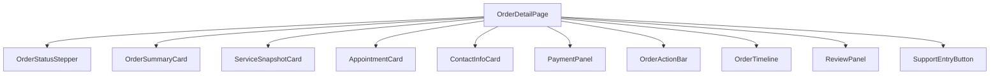
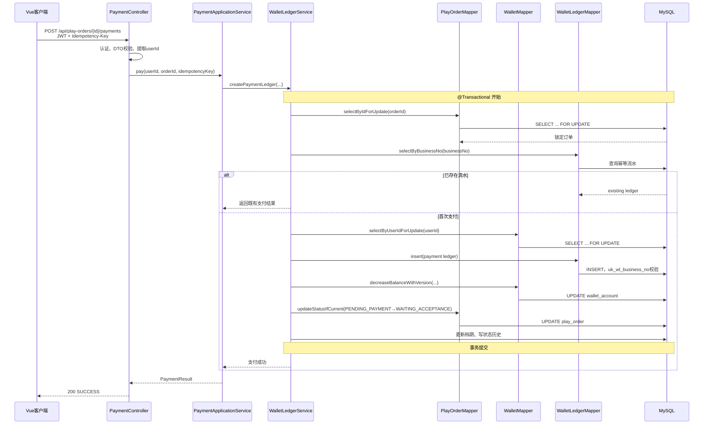
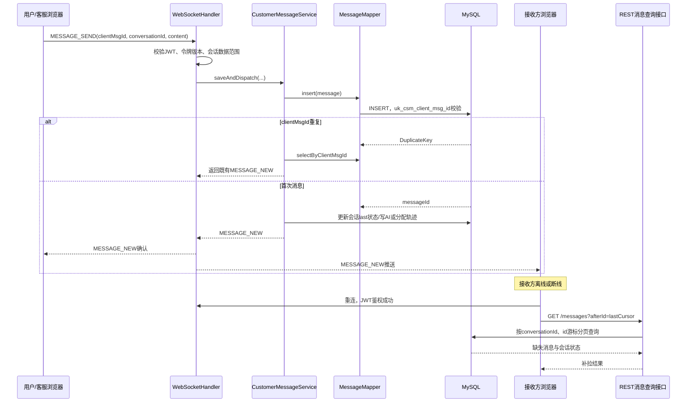

# 游戏陪玩系统详细设计说明书

> 文档版本：V1.0
> 设计依据：《游戏陪玩系统概要设计说明书》V1.0、《需求分析说明书》V1.1
> 技术路线：Java 17、Spring Boot 3、MyBatis-Plus、MySQL 8.0、Vue 3、TypeScript、Spring WebSocket
> 编写日期：2026 年 8 月 11 日

## 1. 数据库物理设计（DDL）

### 1.1 约定

- 数据库名称为 `game_companion`，字符集统一为 `utf8mb4`，排序规则为 `utf8mb4_unicode_ci`，存储引擎为 InnoDB。
- 金额统一使用 `BIGINT` 保存分值（如 `100` 代表 1.00 元），避免浮点误差。
- 状态统一使用 `VARCHAR` 保存对应枚举名称，增强可读性并便于答辩演示。
- `id` 使用自增主键；MySQL 的 `AUTO_INCREMENT` 列不能同时声明 `DEFAULT`，其自增生成规则即为默认生成规则。其余字段均明确 `NOT NULL`、默认值和注释。
- 本设计不强制声明所有物理外键，关系主要由应用层、索引和事务维护，减少批量初始化和状态迁移时的耦合；关键关联列均建立索引。

```sql
CREATE DATABASE IF NOT EXISTS game_companion
  DEFAULT CHARACTER SET utf8mb4
  COLLATE utf8mb4_unicode_ci;
USE game_companion;

CREATE TABLE `user` (
  id BIGINT NOT NULL AUTO_INCREMENT COMMENT '主键ID',
  username VARCHAR(32) NOT NULL DEFAULT '' COMMENT '登录账号',
  password_hash VARCHAR(100) NOT NULL DEFAULT '' COMMENT 'BCrypt密码哈希',
  nickname VARCHAR(32) NOT NULL DEFAULT '' COMMENT '展示昵称',
  mobile VARCHAR(20) NOT NULL DEFAULT '' COMMENT '手机号',
  email VARCHAR(100) NOT NULL DEFAULT '' COMMENT '邮箱',
  avatar_url VARCHAR(500) NOT NULL DEFAULT '' COMMENT '头像文件地址',
  gender TINYINT NOT NULL DEFAULT 0 COMMENT '性别：0未知，1男，2女',
  introduction VARCHAR(500) NOT NULL DEFAULT '' COMMENT '个人简介',
  account_status VARCHAR(20) NOT NULL DEFAULT 'ENABLED' COMMENT '账号状态：ENABLED、DISABLED',
  token_version INT NOT NULL DEFAULT 1 COMMENT 'JWT令牌版本，变更后旧令牌失效',
  last_login_at DATETIME NULL DEFAULT NULL COMMENT '最后登录时间',
  deleted TINYINT NOT NULL DEFAULT 0 COMMENT '逻辑删除：0否，1是',
  created_at DATETIME NOT NULL DEFAULT CURRENT_TIMESTAMP COMMENT '创建时间',
  updated_at DATETIME NOT NULL DEFAULT CURRENT_TIMESTAMP ON UPDATE CURRENT_TIMESTAMP COMMENT '更新时间',
  PRIMARY KEY (id),
  UNIQUE KEY uk_user_username (username),
  UNIQUE KEY uk_user_mobile (mobile),
  UNIQUE KEY uk_user_email (email),
  KEY idx_user_status_created (account_status, created_at)
) ENGINE=InnoDB DEFAULT CHARSET=utf8mb4 COMMENT='用户账号表';

CREATE TABLE `role` (
  id BIGINT NOT NULL AUTO_INCREMENT COMMENT '主键ID',
  role_code VARCHAR(32) NOT NULL DEFAULT '' COMMENT '角色编码：USER、COMPANION、CUSTOMER_SERVICE、ADMIN',
  role_name VARCHAR(50) NOT NULL DEFAULT '' COMMENT '角色名称',
  description VARCHAR(200) NOT NULL DEFAULT '' COMMENT '角色说明',
  enabled TINYINT NOT NULL DEFAULT 1 COMMENT '启用状态：0否，1是',
  created_at DATETIME NOT NULL DEFAULT CURRENT_TIMESTAMP COMMENT '创建时间',
  updated_at DATETIME NOT NULL DEFAULT CURRENT_TIMESTAMP ON UPDATE CURRENT_TIMESTAMP COMMENT '更新时间',
  PRIMARY KEY (id),
  UNIQUE KEY uk_role_code (role_code)
) ENGINE=InnoDB DEFAULT CHARSET=utf8mb4 COMMENT='角色表';

CREATE TABLE user_role (
  id BIGINT NOT NULL AUTO_INCREMENT COMMENT '主键ID',
  user_id BIGINT NOT NULL DEFAULT 0 COMMENT '用户ID',
  role_id BIGINT NOT NULL DEFAULT 0 COMMENT '角色ID',
  created_at DATETIME NOT NULL DEFAULT CURRENT_TIMESTAMP COMMENT '创建时间',
  PRIMARY KEY (id),
  UNIQUE KEY uk_user_role (user_id, role_id),
  KEY idx_user_role_role (role_id, user_id)
) ENGINE=InnoDB DEFAULT CHARSET=utf8mb4 COMMENT='用户角色关系表';

CREATE TABLE companion_application (
  id BIGINT NOT NULL AUTO_INCREMENT COMMENT '主键ID',
  applicant_user_id BIGINT NOT NULL DEFAULT 0 COMMENT '申请用户ID',
  real_name VARCHAR(32) NOT NULL DEFAULT '' COMMENT '真实姓名',
  contact_mobile VARCHAR(20) NOT NULL DEFAULT '' COMMENT '联系手机号',
  introduction VARCHAR(1000) NOT NULL DEFAULT '' COMMENT '申请自我介绍',
  game_capability_json JSON NOT NULL DEFAULT (JSON_ARRAY()) COMMENT '游戏能力JSON数组',
  proof_urls_json JSON NOT NULL DEFAULT (JSON_ARRAY()) COMMENT '能力证明图片地址JSON数组',
  audit_status VARCHAR(20) NOT NULL DEFAULT 'PENDING' COMMENT '审核状态：PENDING、APPROVED、REJECTED',
  audit_by BIGINT NOT NULL DEFAULT 0 COMMENT '审核管理员ID，未审核为0',
  audit_reason VARCHAR(500) NOT NULL DEFAULT '' COMMENT '审核意见或驳回原因',
  audited_at DATETIME NULL DEFAULT NULL COMMENT '审核时间',
  created_at DATETIME NOT NULL DEFAULT CURRENT_TIMESTAMP COMMENT '创建时间',
  updated_at DATETIME NOT NULL DEFAULT CURRENT_TIMESTAMP ON UPDATE CURRENT_TIMESTAMP COMMENT '更新时间',
  PRIMARY KEY (id),
  KEY idx_ca_user_status (applicant_user_id, audit_status),
  KEY idx_ca_status_created (audit_status, created_at)
) ENGINE=InnoDB DEFAULT CHARSET=utf8mb4 COMMENT='陪玩师入驻申请表';

CREATE TABLE companion_profile (
  id BIGINT NOT NULL AUTO_INCREMENT COMMENT '主键ID',
  user_id BIGINT NOT NULL DEFAULT 0 COMMENT '关联用户ID',
  display_name VARCHAR(32) NOT NULL DEFAULT '' COMMENT '陪玩师展示名',
  profile_intro VARCHAR(1000) NOT NULL DEFAULT '' COMMENT '主页简介',
  capability_json JSON NOT NULL DEFAULT (JSON_ARRAY()) COMMENT '认证游戏能力JSON',
  rating_avg DECIMAL(3,1) NOT NULL DEFAULT 5.0 COMMENT '有效评价平均分',
  rating_count INT NOT NULL DEFAULT 0 COMMENT '有效评价数量',
  completed_order_count INT NOT NULL DEFAULT 0 COMMENT '已完成订单数',
  service_status VARCHAR(20) NOT NULL DEFAULT 'RESTING' COMMENT '接单状态：AVAILABLE、BUSY、RESTING、SUSPENDED',
  certification_status VARCHAR(20) NOT NULL DEFAULT 'APPROVED' COMMENT '认证状态：APPROVED、SUSPENDED',
  created_at DATETIME NOT NULL DEFAULT CURRENT_TIMESTAMP COMMENT '创建时间',
  updated_at DATETIME NOT NULL DEFAULT CURRENT_TIMESTAMP ON UPDATE CURRENT_TIMESTAMP COMMENT '更新时间',
  PRIMARY KEY (id),
  UNIQUE KEY uk_cp_user (user_id),
  KEY idx_cp_status_rating (service_status, certification_status, rating_avg)
) ENGINE=InnoDB DEFAULT CHARSET=utf8mb4 COMMENT='陪玩师资料表';

CREATE TABLE game (
  id BIGINT NOT NULL AUTO_INCREMENT COMMENT '主键ID',
  game_name VARCHAR(50) NOT NULL DEFAULT '' COMMENT '游戏名称',
  game_icon_url VARCHAR(500) NOT NULL DEFAULT '' COMMENT '游戏图标地址',
  game_intro VARCHAR(500) NOT NULL DEFAULT '' COMMENT '游戏简介',
  sort_no INT NOT NULL DEFAULT 0 COMMENT '排序号，越小越靠前',
  enabled TINYINT NOT NULL DEFAULT 1 COMMENT '启用状态：0否，1是',
  created_at DATETIME NOT NULL DEFAULT CURRENT_TIMESTAMP COMMENT '创建时间',
  updated_at DATETIME NOT NULL DEFAULT CURRENT_TIMESTAMP ON UPDATE CURRENT_TIMESTAMP COMMENT '更新时间',
  PRIMARY KEY (id),
  UNIQUE KEY uk_game_name (game_name),
  KEY idx_game_enabled_sort (enabled, sort_no)
) ENGINE=InnoDB DEFAULT CHARSET=utf8mb4 COMMENT='游戏基础表';

CREATE TABLE service_type (
  id BIGINT NOT NULL AUTO_INCREMENT COMMENT '主键ID',
  type_name VARCHAR(50) NOT NULL DEFAULT '' COMMENT '服务类型名称',
  type_code VARCHAR(32) NOT NULL DEFAULT '' COMMENT '服务类型编码',
  description VARCHAR(200) NOT NULL DEFAULT '' COMMENT '类型说明',
  sort_no INT NOT NULL DEFAULT 0 COMMENT '排序号',
  enabled TINYINT NOT NULL DEFAULT 1 COMMENT '启用状态：0否，1是',
  created_at DATETIME NOT NULL DEFAULT CURRENT_TIMESTAMP COMMENT '创建时间',
  updated_at DATETIME NOT NULL DEFAULT CURRENT_TIMESTAMP ON UPDATE CURRENT_TIMESTAMP COMMENT '更新时间',
  PRIMARY KEY (id),
  UNIQUE KEY uk_st_code (type_code),
  UNIQUE KEY uk_st_name (type_name),
  KEY idx_st_enabled_sort (enabled, sort_no)
) ENGINE=InnoDB DEFAULT CHARSET=utf8mb4 COMMENT='陪玩服务类型表';

CREATE TABLE tag (
  id BIGINT NOT NULL AUTO_INCREMENT COMMENT '主键ID',
  tag_name VARCHAR(50) NOT NULL DEFAULT '' COMMENT '标签名称',
  tag_category VARCHAR(32) NOT NULL DEFAULT '' COMMENT '标签分类：POSITION、STYLE、HERO等',
  game_id BIGINT NOT NULL DEFAULT 0 COMMENT '所属游戏ID，0表示通用',
  sort_no INT NOT NULL DEFAULT 0 COMMENT '排序号',
  enabled TINYINT NOT NULL DEFAULT 1 COMMENT '启用状态：0否，1是',
  created_at DATETIME NOT NULL DEFAULT CURRENT_TIMESTAMP COMMENT '创建时间',
  updated_at DATETIME NOT NULL DEFAULT CURRENT_TIMESTAMP ON UPDATE CURRENT_TIMESTAMP COMMENT '更新时间',
  PRIMARY KEY (id),
  UNIQUE KEY uk_tag_game_category_name (game_id, tag_category, tag_name),
  KEY idx_tag_enabled_game (enabled, game_id, sort_no)
) ENGINE=InnoDB DEFAULT CHARSET=utf8mb4 COMMENT='服务标签表';

CREATE TABLE companion_service (
  id BIGINT NOT NULL AUTO_INCREMENT COMMENT '主键ID',
  companion_user_id BIGINT NOT NULL DEFAULT 0 COMMENT '陪玩师用户ID',
  game_id BIGINT NOT NULL DEFAULT 0 COMMENT '游戏ID',
  service_type_id BIGINT NOT NULL DEFAULT 0 COMMENT '服务类型ID',
  title VARCHAR(100) NOT NULL DEFAULT '' COMMENT '服务标题',
  description VARCHAR(2000) NOT NULL DEFAULT '' COMMENT '服务说明',
  tag_ids_json JSON NOT NULL DEFAULT (JSON_ARRAY()) COMMENT '标签ID数组JSON',
  price_cents BIGINT NOT NULL DEFAULT 0 COMMENT '每小时价格，单位分',
  min_duration_minutes INT NOT NULL DEFAULT 60 COMMENT '最短服务时长，单位分钟',
  audit_status VARCHAR(20) NOT NULL DEFAULT 'PENDING' COMMENT '审核状态：PENDING、APPROVED、REJECTED',
  service_status VARCHAR(20) NOT NULL DEFAULT 'OFF_SHELF' COMMENT '服务状态：ON_SHELF、OFF_SHELF',
  audit_by BIGINT NOT NULL DEFAULT 0 COMMENT '审核管理员ID',
  audit_reason VARCHAR(500) NOT NULL DEFAULT '' COMMENT '审核意见',
  audit_at DATETIME NULL DEFAULT NULL COMMENT '审核时间',
  deleted TINYINT NOT NULL DEFAULT 0 COMMENT '逻辑删除：0否，1是',
  created_at DATETIME NOT NULL DEFAULT CURRENT_TIMESTAMP COMMENT '创建时间',
  updated_at DATETIME NOT NULL DEFAULT CURRENT_TIMESTAMP ON UPDATE CURRENT_TIMESTAMP COMMENT '更新时间',
  PRIMARY KEY (id),
  KEY idx_cs_list (game_id, service_type_id, audit_status, service_status, price_cents),
  KEY idx_cs_companion_status (companion_user_id, service_status, audit_status)
) ENGINE=InnoDB DEFAULT CHARSET=utf8mb4 COMMENT='陪玩服务项目表';

CREATE TABLE companion_availability (
  id BIGINT NOT NULL AUTO_INCREMENT COMMENT '主键ID',
  companion_user_id BIGINT NOT NULL DEFAULT 0 COMMENT '陪玩师用户ID',
  start_at DATETIME NOT NULL DEFAULT CURRENT_TIMESTAMP COMMENT '可约开始时间',
  end_at DATETIME NOT NULL DEFAULT CURRENT_TIMESTAMP COMMENT '可约结束时间',
  availability_status VARCHAR(20) NOT NULL DEFAULT 'AVAILABLE' COMMENT '状态：AVAILABLE、UNAVAILABLE',
  source_type VARCHAR(20) NOT NULL DEFAULT 'MANUAL' COMMENT '来源：MANUAL、RECURRENCE',
  remark VARCHAR(200) NOT NULL DEFAULT '' COMMENT '备注',
  created_at DATETIME NOT NULL DEFAULT CURRENT_TIMESTAMP COMMENT '创建时间',
  updated_at DATETIME NOT NULL DEFAULT CURRENT_TIMESTAMP ON UPDATE CURRENT_TIMESTAMP COMMENT '更新时间',
  PRIMARY KEY (id),
  KEY idx_ca_companion_time (companion_user_id, start_at, end_at, availability_status)
) ENGINE=InnoDB DEFAULT CHARSET=utf8mb4 COMMENT='陪玩师可约档期表';

CREATE TABLE play_order (
  id BIGINT NOT NULL AUTO_INCREMENT COMMENT '主键ID',
  order_no VARCHAR(32) NOT NULL DEFAULT '' COMMENT '业务订单号',
  user_id BIGINT NOT NULL DEFAULT 0 COMMENT '下单用户ID',
  companion_user_id BIGINT NOT NULL DEFAULT 0 COMMENT '陪玩师用户ID',
  companion_service_id BIGINT NOT NULL DEFAULT 0 COMMENT '服务项目ID',
  game_id BIGINT NOT NULL DEFAULT 0 COMMENT '游戏ID快照',
  service_title_snapshot VARCHAR(100) NOT NULL DEFAULT '' COMMENT '服务标题快照',
  service_type_name_snapshot VARCHAR(50) NOT NULL DEFAULT '' COMMENT '服务类型快照',
  companion_name_snapshot VARCHAR(32) NOT NULL DEFAULT '' COMMENT '陪玩师昵称快照',
  unit_price_cents BIGINT NOT NULL DEFAULT 0 COMMENT '小时单价快照，单位分',
  duration_minutes INT NOT NULL DEFAULT 60 COMMENT '预约时长，单位分钟',
  total_amount_cents BIGINT NOT NULL DEFAULT 0 COMMENT '订单总金额，单位分',
  game_server VARCHAR(50) NOT NULL DEFAULT '' COMMENT '游戏区服',
  game_nickname VARCHAR(50) NOT NULL DEFAULT '' COMMENT '游戏昵称',
  user_remark VARCHAR(500) NOT NULL DEFAULT '' COMMENT '用户需求备注',
  appointment_start_at DATETIME NOT NULL DEFAULT CURRENT_TIMESTAMP COMMENT '预约开始时间',
  appointment_end_at DATETIME NOT NULL DEFAULT CURRENT_TIMESTAMP COMMENT '预约结束时间',
  order_status VARCHAR(20) NOT NULL DEFAULT 'PENDING_PAYMENT' COMMENT '订单状态枚举',
  pay_expire_at DATETIME NOT NULL DEFAULT CURRENT_TIMESTAMP COMMENT '支付截止时间',
  accept_expire_at DATETIME NULL DEFAULT NULL COMMENT '接单截止时间',
  started_at DATETIME NULL DEFAULT NULL COMMENT '实际开始时间',
  ended_at DATETIME NULL DEFAULT NULL COMMENT '实际结束时间',
  confirmed_at DATETIME NULL DEFAULT NULL COMMENT '确认完成时间',
  closed_reason VARCHAR(500) NOT NULL DEFAULT '' COMMENT '关闭或取消原因',
  version INT NOT NULL DEFAULT 0 COMMENT '乐观锁版本号',
  created_at DATETIME NOT NULL DEFAULT CURRENT_TIMESTAMP COMMENT '创建时间',
  updated_at DATETIME NOT NULL DEFAULT CURRENT_TIMESTAMP ON UPDATE CURRENT_TIMESTAMP COMMENT '更新时间',
  PRIMARY KEY (id),
  UNIQUE KEY uk_po_order_no (order_no),
  KEY idx_po_user_status_created (user_id, order_status, created_at),
  KEY idx_po_companion_status_time (companion_user_id, order_status, appointment_start_at),
  KEY idx_po_timeout (order_status, pay_expire_at, accept_expire_at, confirmed_at)
) ENGINE=InnoDB DEFAULT CHARSET=utf8mb4 COMMENT='陪玩订单主表';

CREATE TABLE order_time_slot (
  id BIGINT NOT NULL AUTO_INCREMENT COMMENT '主键ID',
  order_id BIGINT NOT NULL DEFAULT 0 COMMENT '订单ID',
  companion_user_id BIGINT NOT NULL DEFAULT 0 COMMENT '陪玩师用户ID',
  start_at DATETIME NOT NULL DEFAULT CURRENT_TIMESTAMP COMMENT '占用开始时间',
  end_at DATETIME NOT NULL DEFAULT CURRENT_TIMESTAMP COMMENT '占用结束时间',
  slot_status VARCHAR(20) NOT NULL DEFAULT 'TEMPORARY' COMMENT '占用状态：TEMPORARY、EFFECTIVE、RELEASED',
  expire_at DATETIME NULL DEFAULT NULL COMMENT '临时占用过期时间',
  created_at DATETIME NOT NULL DEFAULT CURRENT_TIMESTAMP COMMENT '创建时间',
  updated_at DATETIME NOT NULL DEFAULT CURRENT_TIMESTAMP ON UPDATE CURRENT_TIMESTAMP COMMENT '更新时间',
  PRIMARY KEY (id),
  UNIQUE KEY uk_ots_order (order_id),
  KEY idx_ots_conflict (companion_user_id, slot_status, start_at, end_at),
  KEY idx_ots_expire (slot_status, expire_at)
) ENGINE=InnoDB DEFAULT CHARSET=utf8mb4 COMMENT='订单档期占用表';

CREATE TABLE order_status_history (
  id BIGINT NOT NULL AUTO_INCREMENT COMMENT '主键ID',
  order_id BIGINT NOT NULL DEFAULT 0 COMMENT '订单ID',
  from_status VARCHAR(20) NOT NULL DEFAULT '' COMMENT '迁移前状态，创建时为空字符串',
  to_status VARCHAR(20) NOT NULL DEFAULT '' COMMENT '迁移后状态',
  operator_id BIGINT NOT NULL DEFAULT 0 COMMENT '操作者ID，系统任务为0',
  operator_role VARCHAR(32) NOT NULL DEFAULT 'SYSTEM' COMMENT '操作者角色',
  action_code VARCHAR(50) NOT NULL DEFAULT '' COMMENT '动作编码',
  reason VARCHAR(500) NOT NULL DEFAULT '' COMMENT '原因说明',
  created_at DATETIME NOT NULL DEFAULT CURRENT_TIMESTAMP COMMENT '创建时间',
  PRIMARY KEY (id),
  KEY idx_osh_order_created (order_id, created_at)
) ENGINE=InnoDB DEFAULT CHARSET=utf8mb4 COMMENT='订单状态历史表';

CREATE TABLE wallet_account (
  id BIGINT NOT NULL AUTO_INCREMENT COMMENT '主键ID',
  user_id BIGINT NOT NULL DEFAULT 0 COMMENT '用户ID',
  balance_cents BIGINT NOT NULL DEFAULT 0 COMMENT '可用虚拟余额，单位分',
  frozen_cents BIGINT NOT NULL DEFAULT 0 COMMENT '冻结余额或收益，单位分',
  total_income_cents BIGINT NOT NULL DEFAULT 0 COMMENT '陪玩师累计已结算收益，单位分',
  version INT NOT NULL DEFAULT 0 COMMENT '乐观锁版本号',
  created_at DATETIME NOT NULL DEFAULT CURRENT_TIMESTAMP COMMENT '创建时间',
  updated_at DATETIME NOT NULL DEFAULT CURRENT_TIMESTAMP ON UPDATE CURRENT_TIMESTAMP COMMENT '更新时间',
  PRIMARY KEY (id),
  UNIQUE KEY uk_wa_user (user_id)
) ENGINE=InnoDB DEFAULT CHARSET=utf8mb4 COMMENT='虚拟钱包账户表';

CREATE TABLE wallet_ledger (
  id BIGINT NOT NULL AUTO_INCREMENT COMMENT '主键ID',
  business_no VARCHAR(64) NOT NULL DEFAULT '' COMMENT '幂等业务流水号',
  user_id BIGINT NOT NULL DEFAULT 0 COMMENT '资金所属用户ID',
  order_id BIGINT NOT NULL DEFAULT 0 COMMENT '关联订单ID',
  ledger_type VARCHAR(30) NOT NULL DEFAULT '' COMMENT '流水类型：PAYMENT、REFUND、SETTLEMENT、ADJUSTMENT',
  direction VARCHAR(10) NOT NULL DEFAULT '' COMMENT '方向：IN、OUT',
  amount_cents BIGINT NOT NULL DEFAULT 0 COMMENT '变动金额，单位分且为正数',
  balance_before_cents BIGINT NOT NULL DEFAULT 0 COMMENT '变动前可用余额',
  balance_after_cents BIGINT NOT NULL DEFAULT 0 COMMENT '变动后可用余额',
  frozen_before_cents BIGINT NOT NULL DEFAULT 0 COMMENT '变动前冻结金额',
  frozen_after_cents BIGINT NOT NULL DEFAULT 0 COMMENT '变动后冻结金额',
  remark VARCHAR(500) NOT NULL DEFAULT '' COMMENT '流水说明',
  created_by BIGINT NOT NULL DEFAULT 0 COMMENT '创建者ID，系统为0',
  created_at DATETIME NOT NULL DEFAULT CURRENT_TIMESTAMP COMMENT '创建时间',
  PRIMARY KEY (id),
  UNIQUE KEY uk_wl_business_no (business_no),
  KEY idx_wl_user_created (user_id, created_at),
  KEY idx_wl_order_type (order_id, ledger_type, created_at)
) ENGINE=InnoDB DEFAULT CHARSET=utf8mb4 COMMENT='虚拟资金流水表';

CREATE TABLE review (
  id BIGINT NOT NULL AUTO_INCREMENT COMMENT '主键ID',
  order_id BIGINT NOT NULL DEFAULT 0 COMMENT '订单ID',
  user_id BIGINT NOT NULL DEFAULT 0 COMMENT '评价用户ID',
  companion_user_id BIGINT NOT NULL DEFAULT 0 COMMENT '被评价陪玩师ID',
  score TINYINT NOT NULL DEFAULT 5 COMMENT '评分：1至5',
  tag_json JSON NOT NULL DEFAULT (JSON_ARRAY()) COMMENT '评价标签JSON数组',
  content VARCHAR(1000) NOT NULL DEFAULT '' COMMENT '评价内容',
  display_status VARCHAR(20) NOT NULL DEFAULT 'VISIBLE' COMMENT '展示状态：VISIBLE、HIDDEN',
  created_at DATETIME NOT NULL DEFAULT CURRENT_TIMESTAMP COMMENT '创建时间',
  updated_at DATETIME NOT NULL DEFAULT CURRENT_TIMESTAMP ON UPDATE CURRENT_TIMESTAMP COMMENT '更新时间',
  PRIMARY KEY (id),
  UNIQUE KEY uk_review_order (order_id),
  KEY idx_review_companion_display (companion_user_id, display_status, created_at)
) ENGINE=InnoDB DEFAULT CHARSET=utf8mb4 COMMENT='订单评价表';

CREATE TABLE complaint (
  id BIGINT NOT NULL AUTO_INCREMENT COMMENT '主键ID',
  order_id BIGINT NOT NULL DEFAULT 0 COMMENT '订单ID',
  complainant_user_id BIGINT NOT NULL DEFAULT 0 COMMENT '投诉发起人ID',
  complaint_type VARCHAR(30) NOT NULL DEFAULT '' COMMENT '投诉类型',
  description VARCHAR(2000) NOT NULL DEFAULT '' COMMENT '投诉说明',
  complaint_status VARCHAR(20) NOT NULL DEFAULT 'PENDING' COMMENT '状态：PENDING、PROCESSING、RESOLVED',
  resolution_type VARCHAR(30) NOT NULL DEFAULT '' COMMENT '处理类型：KEEP、FULL_REFUND、PARTIAL_REFUND',
  refund_amount_cents BIGINT NOT NULL DEFAULT 0 COMMENT '退款金额，单位分',
  handled_by BIGINT NOT NULL DEFAULT 0 COMMENT '处理管理员ID',
  handling_opinion VARCHAR(1000) NOT NULL DEFAULT '' COMMENT '处理意见',
  handled_at DATETIME NULL DEFAULT NULL COMMENT '处理时间',
  created_at DATETIME NOT NULL DEFAULT CURRENT_TIMESTAMP COMMENT '创建时间',
  updated_at DATETIME NOT NULL DEFAULT CURRENT_TIMESTAMP ON UPDATE CURRENT_TIMESTAMP COMMENT '更新时间',
  PRIMARY KEY (id),
  KEY idx_complaint_order_status (order_id, complaint_status),
  KEY idx_complaint_status_created (complaint_status, created_at)
) ENGINE=InnoDB DEFAULT CHARSET=utf8mb4 COMMENT='订单投诉表';

CREATE TABLE complaint_evidence (
  id BIGINT NOT NULL AUTO_INCREMENT COMMENT '主键ID',
  complaint_id BIGINT NOT NULL DEFAULT 0 COMMENT '投诉ID',
  file_url VARCHAR(500) NOT NULL DEFAULT '' COMMENT '证据文件地址',
  file_name VARCHAR(200) NOT NULL DEFAULT '' COMMENT '原始文件名',
  sort_no INT NOT NULL DEFAULT 0 COMMENT '排序号',
  created_at DATETIME NOT NULL DEFAULT CURRENT_TIMESTAMP COMMENT '创建时间',
  PRIMARY KEY (id),
  KEY idx_ce_complaint_sort (complaint_id, sort_no)
) ENGINE=InnoDB DEFAULT CHARSET=utf8mb4 COMMENT='投诉证据表';

CREATE TABLE favorite (
  id BIGINT NOT NULL AUTO_INCREMENT COMMENT '主键ID',
  user_id BIGINT NOT NULL DEFAULT 0 COMMENT '用户ID',
  companion_user_id BIGINT NOT NULL DEFAULT 0 COMMENT '被收藏陪玩师ID',
  created_at DATETIME NOT NULL DEFAULT CURRENT_TIMESTAMP COMMENT '创建时间',
  PRIMARY KEY (id),
  UNIQUE KEY uk_favorite_user_companion (user_id, companion_user_id),
  KEY idx_favorite_companion (companion_user_id, created_at)
) ENGINE=InnoDB DEFAULT CHARSET=utf8mb4 COMMENT='陪玩师收藏表';

CREATE TABLE notification (
  id BIGINT NOT NULL AUTO_INCREMENT COMMENT '主键ID',
  user_id BIGINT NOT NULL DEFAULT 0 COMMENT '接收用户ID',
  notification_type VARCHAR(32) NOT NULL DEFAULT '' COMMENT '通知类型',
  title VARCHAR(100) NOT NULL DEFAULT '' COMMENT '通知标题',
  content VARCHAR(1000) NOT NULL DEFAULT '' COMMENT '通知内容',
  related_type VARCHAR(32) NOT NULL DEFAULT '' COMMENT '关联业务类型',
  related_id BIGINT NOT NULL DEFAULT 0 COMMENT '关联业务ID',
  read_status TINYINT NOT NULL DEFAULT 0 COMMENT '已读状态：0否，1是',
  read_at DATETIME NULL DEFAULT NULL COMMENT '读取时间',
  created_at DATETIME NOT NULL DEFAULT CURRENT_TIMESTAMP COMMENT '创建时间',
  PRIMARY KEY (id),
  KEY idx_n_user_read_created (user_id, read_status, created_at)
) ENGINE=InnoDB DEFAULT CHARSET=utf8mb4 COMMENT='站内通知表';

CREATE TABLE announcement (
  id BIGINT NOT NULL AUTO_INCREMENT COMMENT '主键ID',
  title VARCHAR(100) NOT NULL DEFAULT '' COMMENT '公告标题',
  content VARCHAR(5000) NOT NULL DEFAULT '' COMMENT '公告内容',
  publish_status VARCHAR(20) NOT NULL DEFAULT 'DRAFT' COMMENT '状态：DRAFT、PUBLISHED、REVOKED',
  published_by BIGINT NOT NULL DEFAULT 0 COMMENT '发布管理员ID',
  published_at DATETIME NULL DEFAULT NULL COMMENT '发布时间',
  created_at DATETIME NOT NULL DEFAULT CURRENT_TIMESTAMP COMMENT '创建时间',
  updated_at DATETIME NOT NULL DEFAULT CURRENT_TIMESTAMP ON UPDATE CURRENT_TIMESTAMP COMMENT '更新时间',
  PRIMARY KEY (id),
  KEY idx_an_publish_time (publish_status, published_at)
) ENGINE=InnoDB DEFAULT CHARSET=utf8mb4 COMMENT='平台公告表';

CREATE TABLE customer_service_account (
  id BIGINT NOT NULL AUTO_INCREMENT COMMENT '主键ID',
  user_id BIGINT NOT NULL DEFAULT 0 COMMENT '关联内部用户账号ID',
  cs_account VARCHAR(32) NOT NULL DEFAULT '' COMMENT '客服账号名',
  cs_name VARCHAR(32) NOT NULL DEFAULT '' COMMENT '客服姓名',
  contact_mobile VARCHAR(20) NOT NULL DEFAULT '' COMMENT '客服联系方式',
  account_status VARCHAR(20) NOT NULL DEFAULT 'ENABLED' COMMENT '账号状态：ENABLED、DISABLED',
  work_status VARCHAR(20) NOT NULL DEFAULT 'OFFLINE' COMMENT '工作状态：ONLINE、BUSY、OFFLINE',
  force_change_password TINYINT NOT NULL DEFAULT 1 COMMENT '首次或重置后强制改密：0否，1是',
  max_active_conversations INT NOT NULL DEFAULT 5 COMMENT '最大并行处理会话数',
  disabled_reason VARCHAR(500) NOT NULL DEFAULT '' COMMENT '禁用原因',
  created_by BIGINT NOT NULL DEFAULT 0 COMMENT '创建管理员ID',
  created_at DATETIME NOT NULL DEFAULT CURRENT_TIMESTAMP COMMENT '创建时间',
  updated_at DATETIME NOT NULL DEFAULT CURRENT_TIMESTAMP ON UPDATE CURRENT_TIMESTAMP COMMENT '更新时间',
  PRIMARY KEY (id),
  UNIQUE KEY uk_csa_user (user_id),
  UNIQUE KEY uk_csa_account (cs_account),
  KEY idx_csa_work_status (account_status, work_status)
) ENGINE=InnoDB DEFAULT CHARSET=utf8mb4 COMMENT='人工客服账号表';

CREATE TABLE customer_conversation (
  id BIGINT NOT NULL AUTO_INCREMENT COMMENT '主键ID',
  conversation_no VARCHAR(32) NOT NULL DEFAULT '' COMMENT '会话编号',
  initiator_user_id BIGINT NOT NULL DEFAULT 0 COMMENT '发起用户或陪玩师ID',
  source_type VARCHAR(20) NOT NULL DEFAULT 'HELP_CENTER' COMMENT '来源：HELP_CENTER、PROFILE、ORDER',
  related_order_id BIGINT NOT NULL DEFAULT 0 COMMENT '关联订单ID，无关联为0',
  conversation_status VARCHAR(20) NOT NULL DEFAULT 'AI_PROCESSING' COMMENT '会话状态枚举',
  reception_mode VARCHAR(20) NOT NULL DEFAULT 'AI' COMMENT '接待模式：AI、HUMAN、ADMIN',
  current_cs_account_id BIGINT NOT NULL DEFAULT 0 COMMENT '当前客服账号ID，无客服为0',
  transfer_reason VARCHAR(500) NOT NULL DEFAULT '' COMMENT '转人工或转管理员原因',
  unresolved_count INT NOT NULL DEFAULT 0 COMMENT '连续未解决次数',
  closed_category VARCHAR(50) NOT NULL DEFAULT '' COMMENT '关闭问题分类',
  closed_result VARCHAR(1000) NOT NULL DEFAULT '' COMMENT '关闭处理结果',
  closed_at DATETIME NULL DEFAULT NULL COMMENT '关闭时间',
  version INT NOT NULL DEFAULT 0 COMMENT '乐观锁版本号',
  created_at DATETIME NOT NULL DEFAULT CURRENT_TIMESTAMP COMMENT '创建时间',
  updated_at DATETIME NOT NULL DEFAULT CURRENT_TIMESTAMP ON UPDATE CURRENT_TIMESTAMP COMMENT '更新时间',
  PRIMARY KEY (id),
  UNIQUE KEY uk_cc_conversation_no (conversation_no),
  KEY idx_cc_queue (conversation_status, current_cs_account_id, created_at),
  KEY idx_cc_initiator_created (initiator_user_id, created_at),
  KEY idx_cc_order (related_order_id)
) ENGINE=InnoDB DEFAULT CHARSET=utf8mb4 COMMENT='客服会话主表';

CREATE TABLE customer_service_message (
  id BIGINT NOT NULL AUTO_INCREMENT COMMENT '主键ID',
  conversation_id BIGINT NOT NULL DEFAULT 0 COMMENT '会话ID',
  client_msg_id VARCHAR(64) NOT NULL DEFAULT '' COMMENT '客户端消息幂等ID',
  sender_type VARCHAR(20) NOT NULL DEFAULT '' COMMENT '发送者：USER、AI、CS、SYSTEM、ADMIN',
  sender_id BIGINT NOT NULL DEFAULT 0 COMMENT '发送者ID，AI或系统为0',
  content_type VARCHAR(20) NOT NULL DEFAULT 'TEXT' COMMENT '内容类型，首期仅TEXT',
  content VARCHAR(4000) NOT NULL DEFAULT '' COMMENT '文本消息内容',
  ai_mark TINYINT NOT NULL DEFAULT 0 COMMENT 'AI标识：0否，1是',
  read_status TINYINT NOT NULL DEFAULT 0 COMMENT '已读状态：0否，1是',
  created_at DATETIME NOT NULL DEFAULT CURRENT_TIMESTAMP COMMENT '创建时间',
  PRIMARY KEY (id),
  UNIQUE KEY uk_csm_client_msg_id (client_msg_id),
  KEY idx_csm_conversation_id (conversation_id, id),
  KEY idx_csm_sender_created (sender_id, created_at)
) ENGINE=InnoDB DEFAULT CHARSET=utf8mb4 COMMENT='客服文本消息表';

CREATE TABLE conversation_assignment (
  id BIGINT NOT NULL AUTO_INCREMENT COMMENT '主键ID',
  conversation_id BIGINT NOT NULL DEFAULT 0 COMMENT '会话ID',
  assignment_type VARCHAR(30) NOT NULL DEFAULT '' COMMENT '类型：AI_TRANSFER、CLAIM、ASSIGN、TRANSFER、ESCALATE_ADMIN',
  from_cs_account_id BIGINT NOT NULL DEFAULT 0 COMMENT '原客服账号ID',
  to_cs_account_id BIGINT NOT NULL DEFAULT 0 COMMENT '目标客服账号ID',
  operator_id BIGINT NOT NULL DEFAULT 0 COMMENT '操作人ID，系统为0',
  reason VARCHAR(500) NOT NULL DEFAULT '' COMMENT '分配或转交原因',
  created_at DATETIME NOT NULL DEFAULT CURRENT_TIMESTAMP COMMENT '创建时间',
  PRIMARY KEY (id),
  KEY idx_cas_conversation_created (conversation_id, created_at),
  KEY idx_cas_to_cs_created (to_cs_account_id, created_at)
) ENGINE=InnoDB DEFAULT CHARSET=utf8mb4 COMMENT='客服会话分配轨迹表';

CREATE TABLE internal_note (
  id BIGINT NOT NULL AUTO_INCREMENT COMMENT '主键ID',
  conversation_id BIGINT NOT NULL DEFAULT 0 COMMENT '会话ID',
  author_user_id BIGINT NOT NULL DEFAULT 0 COMMENT '客服或管理员用户ID',
  author_role VARCHAR(32) NOT NULL DEFAULT '' COMMENT '作者角色',
  content VARCHAR(2000) NOT NULL DEFAULT '' COMMENT '内部备注内容，用户不可见',
  created_at DATETIME NOT NULL DEFAULT CURRENT_TIMESTAMP COMMENT '创建时间',
  PRIMARY KEY (id),
  KEY idx_in_conversation_created (conversation_id, created_at)
) ENGINE=InnoDB DEFAULT CHARSET=utf8mb4 COMMENT='客服内部备注表';

CREATE TABLE ai_knowledge_base (
  id BIGINT NOT NULL AUTO_INCREMENT COMMENT '主键ID',
  category VARCHAR(50) NOT NULL DEFAULT '' COMMENT '知识分类',
  title VARCHAR(100) NOT NULL DEFAULT '' COMMENT '问题标题',
  keywords VARCHAR(1000) NOT NULL DEFAULT '' COMMENT '逗号分隔关键词',
  standard_answer VARCHAR(4000) NOT NULL DEFAULT '' COMMENT '标准答案模板',
  priority INT NOT NULL DEFAULT 0 COMMENT '匹配优先级，越大越优先',
  enabled TINYINT NOT NULL DEFAULT 1 COMMENT '启用状态：0否，1是',
  maintained_by BIGINT NOT NULL DEFAULT 0 COMMENT '维护管理员ID',
  created_at DATETIME NOT NULL DEFAULT CURRENT_TIMESTAMP COMMENT '创建时间',
  updated_at DATETIME NOT NULL DEFAULT CURRENT_TIMESTAMP ON UPDATE CURRENT_TIMESTAMP COMMENT '更新时间',
  PRIMARY KEY (id),
  UNIQUE KEY uk_akb_category_title (category, title),
  KEY idx_akb_enabled_priority (enabled, priority)
) ENGINE=InnoDB DEFAULT CHARSET=utf8mb4 COMMENT='AI客服知识库表';

CREATE TABLE ai_call_log (
  id BIGINT NOT NULL AUTO_INCREMENT COMMENT '主键ID',
  conversation_id BIGINT NOT NULL DEFAULT 0 COMMENT '会话ID',
  knowledge_base_id BIGINT NOT NULL DEFAULT 0 COMMENT '命中知识库ID，未命中为0',
  provider VARCHAR(32) NOT NULL DEFAULT 'KNOWLEDGE_BASE' COMMENT '提供方：KNOWLEDGE_BASE、OLLAMA、EXTERNAL',
  request_summary VARCHAR(1000) NOT NULL DEFAULT '' COMMENT '脱敏请求摘要',
  response_summary VARCHAR(1000) NOT NULL DEFAULT '' COMMENT '脱敏响应摘要',
  confidence DECIMAL(4,3) NOT NULL DEFAULT 0.000 COMMENT '置信度，0至1',
  decision VARCHAR(30) NOT NULL DEFAULT '' COMMENT '决策：CONTINUE_AI、TRANSFER_HUMAN、FALLBACK_FAQ',
  error_message VARCHAR(500) NOT NULL DEFAULT '' COMMENT '异常摘要',
  elapsed_ms INT NOT NULL DEFAULT 0 COMMENT '调用耗时毫秒',
  created_at DATETIME NOT NULL DEFAULT CURRENT_TIMESTAMP COMMENT '创建时间',
  PRIMARY KEY (id),
  KEY idx_acl_conversation_created (conversation_id, created_at),
  KEY idx_acl_decision_created (decision, created_at)
) ENGINE=InnoDB DEFAULT CHARSET=utf8mb4 COMMENT='AI客服调用日志表';

CREATE TABLE service_evaluation (
  id BIGINT NOT NULL AUTO_INCREMENT COMMENT '主键ID',
  conversation_id BIGINT NOT NULL DEFAULT 0 COMMENT '已关闭客服会话ID',
  evaluator_user_id BIGINT NOT NULL DEFAULT 0 COMMENT '评价用户ID',
  score TINYINT NOT NULL DEFAULT 5 COMMENT '满意度评分：1至5',
  content VARCHAR(1000) NOT NULL DEFAULT '' COMMENT '评价内容',
  created_at DATETIME NOT NULL DEFAULT CURRENT_TIMESTAMP COMMENT '创建时间',
  PRIMARY KEY (id),
  UNIQUE KEY uk_se_conversation (conversation_id),
  KEY idx_se_evaluator_created (evaluator_user_id, created_at)
) ENGINE=InnoDB DEFAULT CHARSET=utf8mb4 COMMENT='客服满意度评价表';

CREATE TABLE operation_log (
  id BIGINT NOT NULL AUTO_INCREMENT COMMENT '主键ID',
  operator_id BIGINT NOT NULL DEFAULT 0 COMMENT '操作者用户ID',
  operator_role VARCHAR(32) NOT NULL DEFAULT '' COMMENT '操作者角色',
  operation_type VARCHAR(50) NOT NULL DEFAULT '' COMMENT '操作类型',
  target_type VARCHAR(50) NOT NULL DEFAULT '' COMMENT '目标对象类型',
  target_id BIGINT NOT NULL DEFAULT 0 COMMENT '目标对象ID',
  before_data VARCHAR(4000) NOT NULL DEFAULT '' COMMENT '变更前脱敏数据JSON',
  after_data VARCHAR(4000) NOT NULL DEFAULT '' COMMENT '变更后脱敏数据JSON',
  reason VARCHAR(500) NOT NULL DEFAULT '' COMMENT '操作原因',
  request_id VARCHAR(64) NOT NULL DEFAULT '' COMMENT '请求追踪ID',
  ip_address VARCHAR(64) NOT NULL DEFAULT '' COMMENT '操作IP地址',
  created_at DATETIME NOT NULL DEFAULT CURRENT_TIMESTAMP COMMENT '创建时间',
  PRIMARY KEY (id),
  KEY idx_ol_operator_created (operator_id, created_at),
  KEY idx_ol_target (target_type, target_id, created_at),
  KEY idx_ol_request (request_id)
) ENGINE=InnoDB DEFAULT CHARSET=utf8mb4 COMMENT='后台与客服操作审计日志表';
```

### 1.2 幂等实现说明

**资金流水幂等。** `wallet_ledger.uk_wl_business_no` 对 `business_no` 建立唯一索引。支付请求由前端 `Idempotency-Key` 与订单号组合生成业务号，例如 `PAY:{orderNo}:{key}`。事务中先尝试插入流水：若唯一索引冲突，查询并返回既有流水结果，不再次扣余额；若插入成功才继续更新订单。这样可以抵御浏览器重试、网络超时后的重复点击和接口重复投递。

**客服消息幂等。** `customer_service_message.uk_csm_client_msg_id` 对客户端生成的 UUID 建立唯一索引。服务端先持久化消息，再推送；重复的 `clientMsgId` 插入失败时查询已有消息并返回原消息 ID，绝不再次生成消息或再触发 AI 回复。消息真实来源是 MySQL，而 WebSocket 仅是即时通知通道。

## 2. 核心 REST 接口详细定义

### 2.1 通用约定

- 所有成功响应均使用 `{ "code": "SUCCESS", "message": "操作成功", "data": {} }`。
- 写操作的 `Idempotency-Key` 为长度 16～64 的 UUID/随机字符串；同一语义请求重试必须复用同一键。
- `Authorization` 使用 `Bearer <JWT>`；JWT 中角色、账号状态及 `tokenVersion` 会在后端再次校验。
- JSON Schema 中的 `x-java-validation` 表示 DTO 上对应 Jakarta Validation 注解。

### 2.2 创建订单（FR-U07、FR-U08）

- **URL：** `POST /api/play-orders`
- **权限：** `USER` 或具有普通用户身份的陪玩师；禁止预约自己服务。
- **请求头：** `Authorization: Bearer <JWT>`、`Idempotency-Key: <UUID>`、`Content-Type: application/json`

```json
{
  "$schema": "https://json-schema.org/draft/2020-12/schema",
  "type": "object",
  "required": ["companionServiceId", "appointmentStartAt", "durationMinutes", "gameServer", "gameNickname"],
  "properties": {
    "companionServiceId": {"type": "integer", "minimum": 1, "x-java-validation": "@NotNull @Positive"},
    "appointmentStartAt": {"type": "string", "format": "date-time", "x-java-validation": "@NotNull @Future"},
    "durationMinutes": {"type": "integer", "minimum": 60, "multipleOf": 30, "maximum": 720, "x-java-validation": "@NotNull @Min(60) @Max(720)"},
    "gameServer": {"type": "string", "minLength": 1, "maxLength": 50, "x-java-validation": "@NotBlank @Size(max=50)"},
    "gameNickname": {"type": "string", "minLength": 1, "maxLength": 50, "x-java-validation": "@NotBlank @Size(max=50)"},
    "userRemark": {"type": "string", "maxLength": 500, "default": "", "x-java-validation": "@Size(max=500)"}
  },
  "additionalProperties": false
}
```

```json
{
  "code": "SUCCESS",
  "message": "订单创建成功，请在15分钟内完成模拟支付",
  "data": {
    "orderId": 10001,
    "orderNo": "PO202608110001",
    "orderStatus": "PENDING_PAYMENT",
    "totalAmountCents": 6800,
    "payExpireAt": "2026-08-11T14:15:00",
    "appointmentStartAt": "2026-08-12T20:00:00",
    "appointmentEndAt": "2026-08-12T22:00:00"
  }
}
```

### 2.3 模拟支付订单（FR-U09）

- **URL：** `POST /api/play-orders/{orderId}/payments`
- **权限：** 订单下单用户。
- **请求头：** `Authorization: Bearer <JWT>`、`Idempotency-Key: <UUID>`、`Content-Type: application/json`

```json
{
  "$schema": "https://json-schema.org/draft/2020-12/schema",
  "type": "object",
  "required": ["paymentChannel"],
  "properties": {
    "paymentChannel": {"type": "string", "enum": ["VIRTUAL_BALANCE"], "x-java-validation": "@NotBlank @Pattern(regexp=\"VIRTUAL_BALANCE\")"},
    "clientRequestAt": {"type": "string", "format": "date-time", "x-java-validation": "@NotNull"}
  },
  "additionalProperties": false
}
```

```json
{
  "code": "SUCCESS",
  "message": "模拟支付成功，等待陪玩师接单",
  "data": {
    "orderId": 10001,
    "orderStatus": "WAITING_ACCEPTANCE",
    "paidAmountCents": 6800,
    "balanceAfterCents": 3200,
    "acceptExpireAt": "2026-08-11T14:30:00",
    "ledgerBusinessNo": "PAY:PO202608110001:4a5d7c"
  }
}
```

### 2.4 陪玩师接单（FR-P13）

- **URL：** `POST /api/companion/orders/{orderId}/accept`
- **权限：** 与订单 `companion_user_id` 一致的已认证陪玩师。
- **请求头：** `Authorization: Bearer <JWT>`、`Idempotency-Key: <UUID>`、`Content-Type: application/json`

```json
{
  "$schema": "https://json-schema.org/draft/2020-12/schema",
  "type": "object",
  "required": ["confirm"],
  "properties": {
    "confirm": {"type": "boolean", "const": true, "x-java-validation": "@AssertTrue"},
    "companionRemark": {"type": "string", "maxLength": 300, "default": "", "x-java-validation": "@Size(max=300)"}
  },
  "additionalProperties": false
}
```

```json
{
  "code": "SUCCESS",
  "message": "接单成功，订单等待服务开始",
  "data": {
    "orderId": 10001,
    "orderStatus": "WAITING_SERVICE",
    "appointmentStartAt": "2026-08-12T20:00:00",
    "contactInfoVisible": true
  }
}
```

### 2.5 客服领取会话（FR-C24、FR-C25）

- **URL：** `POST /api/customer-service/conversations/{conversationId}/claim`
- **权限：** `CUSTOMER_SERVICE`，账号启用、已完成首次改密且工作状态为 `ONLINE`。
- **请求头：** `Authorization: Bearer <JWT>`、`Idempotency-Key: <UUID>`、`Content-Type: application/json`

```json
{
  "$schema": "https://json-schema.org/draft/2020-12/schema",
  "type": "object",
  "required": ["expectedVersion"],
  "properties": {
    "expectedVersion": {"type": "integer", "minimum": 0, "x-java-validation": "@NotNull @Min(0)"},
    "claimRemark": {"type": "string", "maxLength": 300, "default": "", "x-java-validation": "@Size(max=300)"}
  },
  "additionalProperties": false
}
```

```json
{
  "code": "SUCCESS",
  "message": "会话领取成功",
  "data": {
    "conversationId": 20001,
    "conversationNo": "CS202608110001",
    "conversationStatus": "HUMAN_PROCESSING",
    "currentCsAccountId": 101,
    "version": 3,
    "messageCursor": 505
  }
}
```

### 2.6 触发 AI 客服应答（FR-C09、FR-C16～FR-C22）

- **URL：** `POST /api/customer-service/conversations/{conversationId}/ai-responses`
- **权限：** 会话发起人本人；调用不允许携带其他用户或未关联订单数据。
- **请求头：** `Authorization: Bearer <JWT>`、`Idempotency-Key: <UUID>`、`Content-Type: application/json`

```json
{
  "$schema": "https://json-schema.org/draft/2020-12/schema",
  "type": "object",
  "required": ["clientMsgId", "content"],
  "properties": {
    "clientMsgId": {"type": "string", "format": "uuid", "x-java-validation": "@NotBlank @Size(max=64)"},
    "content": {"type": "string", "minLength": 1, "maxLength": 4000, "x-java-validation": "@NotBlank @Size(max=4000)"},
    "relatedOrderId": {"type": "integer", "minimum": 1, "x-java-validation": "@Positive"},
    "requestHuman": {"type": "boolean", "default": false, "x-java-validation": "无"}
  },
  "additionalProperties": false
}
```

```json
{
  "code": "SUCCESS",
  "message": "AI客服已处理",
  "data": {
    "conversationId": 20001,
    "conversationStatus": "AI_PROCESSING",
    "decision": "CONTINUE_AI",
    "userMessageId": 506,
    "aiMessage": {
      "messageId": 507,
      "senderType": "AI",
      "aiMark": true,
      "content": "【AI客服】您的订单支付后会进入待接单状态，陪玩师需在30分钟内处理。"
    }
  }
}
```

### 2.7 自定义失败错误码

| HTTP | 错误码 | 含义 |
|---:|---|---|
| 401 | `AUTH_TOKEN_INVALID` | JWT 不存在、签名无效或已过期 |
| 401 | `AUTH_TOKEN_VERSION_MISMATCH` | 账号禁用、改密或注销后旧令牌失效 |
| 403 | `PERMISSION_DENIED` | 角色无接口权限 |
| 403 | `PERMISSION_DATA_SCOPE_DENIED` | 访问了非本人或非授权数据 |
| 404 | `ORDER_NOT_FOUND` | 订单不存在 |
| 409 | `ORDER_STATUS_INVALID` | 当前订单状态不允许该操作 |
| 409 | `ORDER_ALREADY_PAID` | 订单已经支付 |
| 409 | `ORDER_ACCEPT_EXPIRED` | 已超过接单截止时间 |
| 409 | `SLOT_CONFLICT` | 预约时段与有效占用冲突 |
| 422 | `SERVICE_NOT_AVAILABLE` | 服务未上架、未审核或陪玩师不可接单 |
| 422 | `WALLET_BALANCE_INSUFFICIENT` | 虚拟余额不足 |
| 409 | `WALLET_LEDGER_DUPLICATE` | 业务流水重复，返回既有处理结果 |
| 409 | `IDEMPOTENCY_KEY_CONFLICT` | 相同幂等键对应了不同请求内容 |
| 404 | `CS_CONVERSATION_NOT_FOUND` | 客服会话不存在 |
| 409 | `CS_CONVERSATION_ALREADY_CLAIMED` | 会话已被其他客服领取 |
| 422 | `CS_AGENT_NOT_ONLINE` | 客服未在线、已禁用或未完成首次改密 |
| 409 | `CS_MESSAGE_DUPLICATE` | `clientMsgId` 已处理 |
| 422 | `CS_CONVERSATION_CLOSED` | 已关闭会话不能继续发送消息 |
| 503 | `AI_SERVICE_UNAVAILABLE` | AI 模型不可用，系统将降级或转人工 |
| 422 | `AI_TRANSFER_REQUIRED` | 命中敏感/低置信度规则，必须转人工 |

## 3. 核心类与领域模型设计

### 3.1 PlayOrder 与 OrderStatus

```java
package com.gameplay.order.domain;

import java.time.LocalDateTime;

public class PlayOrder {
    private Long id;
    private String orderNo;
    private Long userId;
    private Long companionUserId;
    private Long companionServiceId;
    private Long gameId;
    private String serviceTitleSnapshot;
    private long unitPriceCents;
    private int durationMinutes;
    private long totalAmountCents;
    private LocalDateTime appointmentStartAt;
    private LocalDateTime appointmentEndAt;
    private OrderStatus orderStatus;
    private LocalDateTime payExpireAt;
    private LocalDateTime acceptExpireAt;
    private LocalDateTime startedAt;
    private LocalDateTime endedAt;
    private LocalDateTime confirmedAt;
    private int version;

    public boolean canTransitionTo(OrderStatus target) {
        return this.orderStatus.canTransitionTo(target);
    }
}

enum OrderStatus {
    PENDING_PAYMENT,
    WAITING_ACCEPTANCE,
    WAITING_SERVICE,
    IN_SERVICE,
    WAITING_CONFIRMATION,
    AFTER_SALES,
    COMPLETED,
    CLOSED;

    public boolean canTransitionTo(OrderStatus target) {
        return switch (this) {
            case PENDING_PAYMENT -> target == WAITING_ACCEPTANCE || target == CLOSED;
            case WAITING_ACCEPTANCE -> target == WAITING_SERVICE || target == CLOSED;
            case WAITING_SERVICE -> target == IN_SERVICE || target == AFTER_SALES || target == CLOSED;
            case IN_SERVICE -> target == WAITING_CONFIRMATION || target == AFTER_SALES;
            case WAITING_CONFIRMATION -> target == COMPLETED || target == AFTER_SALES;
            case COMPLETED -> target == AFTER_SALES;
            case AFTER_SALES -> target == COMPLETED || target == CLOSED;
            case CLOSED -> false;
        };
    }
}
```

```java
public interface OrderService {
    PlayOrder createOrder(Long userId, CreateOrderCommand command, String idempotencyKey);
    PaymentResult payByVirtualBalance(Long userId, Long orderId, PayOrderCommand command, String idempotencyKey);
    void acceptOrder(Long companionUserId, Long orderId, String idempotencyKey);
    void rejectOrder(Long companionUserId, Long orderId, String reason, String idempotencyKey);
    void startService(Long companionUserId, Long orderId);
    void endService(Long companionUserId, Long orderId);
    void confirmCompleted(Long userId, Long orderId, String idempotencyKey);
    void closeExpiredPendingPayment(Long orderId);
    void closeExpiredWaitingAcceptance(Long orderId);
    void autoConfirmCompleted(Long orderId);
    void transition(PlayOrder order, OrderStatus target, Long operatorId, String operatorRole, String action, String reason);
}
```

`transition` 是唯一状态迁移入口：先校验状态机，再校验操作者与时间窗口，更新订单主表、写入 `order_status_history`，并根据动作触发档期/资金领域服务。禁止 Controller、客服和 AI 直接更新 `play_order.order_status`。

### 3.2 WalletLedgerService.createPaymentLedger 伪代码

```java
@Transactional(rollbackFor = Exception.class)
public PaymentResult createPaymentLedger(Long userId, Long orderId, String idempotencyKey) {
    PlayOrder order = orderMapper.selectByIdForUpdate(orderId);
    require(order != null, ErrorCode.ORDER_NOT_FOUND);
    require(order.getUserId().equals(userId), ErrorCode.PERMISSION_DATA_SCOPE_DENIED);
    require(order.getOrderStatus() == OrderStatus.PENDING_PAYMENT, ErrorCode.ORDER_STATUS_INVALID);
    require(LocalDateTime.now().isBefore(order.getPayExpireAt()), ErrorCode.ORDER_PAYMENT_EXPIRED);

    String businessNo = "PAY:" + order.getOrderNo() + ":" + idempotencyKey;
    WalletLedger existing = ledgerMapper.selectByBusinessNo(businessNo);
    if (existing != null) {
        return PaymentResult.fromExisting(existing, order);
    }

    WalletAccount wallet = walletMapper.selectByUserIdForUpdate(userId);
    require(wallet.getBalanceCents() >= order.getTotalAmountCents(), ErrorCode.WALLET_BALANCE_INSUFFICIENT);

    WalletLedger ledger = WalletLedger.payment(businessNo, userId, orderId, wallet, order.getTotalAmountCents());
    try {
        ledgerMapper.insert(ledger); // uk_wl_business_no 是最终幂等防线
    } catch (DuplicateKeyException ex) {
        return PaymentResult.fromExisting(ledgerMapper.selectByBusinessNo(businessNo), order);
    }

    int walletRows = walletMapper.decreaseBalanceWithVersion(
        wallet.getId(), wallet.getVersion(), order.getTotalAmountCents());
    require(walletRows == 1, ErrorCode.WALLET_CONCURRENT_MODIFICATION);

    int orderRows = orderMapper.updateStatusIfCurrent(
        orderId, OrderStatus.PENDING_PAYMENT, OrderStatus.WAITING_ACCEPTANCE,
        LocalDateTime.now().plusMinutes(30));
    require(orderRows == 1, ErrorCode.ORDER_STATUS_INVALID);

    slotMapper.activateByOrderId(orderId);
    historyMapper.insert(OrderStatusHistory.of(orderId, OrderStatus.PENDING_PAYMENT,
        OrderStatus.WAITING_ACCEPTANCE, userId, "USER", "PAY", "模拟支付成功"));
    notificationService.notifyCompanionNewOrder(order.getCompanionUserId(), orderId);
    return PaymentResult.success(orderId, businessNo);
}
```

该方法将**锁定订单、检查既有流水、锁定钱包、插入流水、扣减余额、更新订单、激活档期、写状态轨迹**放在同一个 `@Transactional` 边界内。任一操作抛异常即回滚，避免出现“扣钱但订单未支付”的半完成状态。

### 3.3 AI 策略接口、实现与降级

```java
public interface AiResponder {
    AiResponse respond(AiRequest request);
    String provider();
}

@Component
public class KnowledgeBaseResponder implements AiResponder {
    @Override
    public AiResponse respond(AiRequest request) {
        KnowledgeMatch match = knowledgeBaseService.match(request.content(), request.intentHints());
        if (match == null) {
            return AiResponse.lowConfidence("暂未匹配到可靠规则", 0.0D);
        }
        return AiResponse.success("【AI客服】" + match.standardAnswer(), match.confidence());
    }
    @Override public String provider() { return "KNOWLEDGE_BASE"; }
}

@Component
@ConditionalOnProperty(name = "ai.model.enabled", havingValue = "true")
public class ModelEnhancedResponder implements AiResponder {
    @Override
    public AiResponse respond(AiRequest request) {
        // 仅传递当前会话必要消息、脱敏订单摘要和知识库候选内容。
        return modelClient.generate(request);
    }
    @Override public String provider() { return "MODEL"; }
}

@Service
public class AiResponseFacade {
    private final KnowledgeBaseResponder knowledgeBaseResponder;
    private final Optional<ModelEnhancedResponder> modelResponder;
    private final TransferDecisionService decisionService;

    public AiProcessResult process(AiRequest request) {
        AiResponse base = knowledgeBaseResponder.respond(request);
        AiResponse response = base;
        if (base.confidence() < 0.70D && modelResponder.isPresent()) {
            try {
                response = modelResponder.get().respond(request);
            } catch (Exception ignored) {
                response = base.withFallback("模型不可用，已回退知识库");
            }
        }
        TransferDecision decision = decisionService.decide(request, response);
        return AiProcessResult.of(response, decision);
    }
}
```

策略模式使 `KnowledgeBaseResponder` 始终可用，模型增强只在 `ai.model.enabled=true` 时启用。模型超时、返回空结果、置信度不足、敏感意图、连续未解决或用户主动要求人工时，`TransferDecisionService` 返回 `TRANSFER_HUMAN`；系统写入 AI/系统消息和会话轨迹后进入人工队列。

## 4. 前端页面与交互设计

### 4.1 用户端订单详情页

组件树：



| 按钮/组件 | 显示条件 | 提交后行为 |
|---|---|---|
| `立即支付` | 当前用户为下单人，状态为 `PENDING_PAYMENT`，当前时间小于 `payExpireAt` | 调用支付接口；加载期间禁用按钮；成功后刷新订单 |
| `取消订单` | 下单人，状态为 `PENDING_PAYMENT` 或符合取消规则的 `WAITING_ACCEPTANCE/WAITING_SERVICE` | 弹出原因与退款规则确认框 |
| `联系客服` | 登录用户且订单归属本人或本人为接单陪玩师 | 跳转 `/support?orderId={id}`，自动关联订单摘要 |
| `游戏联系信息` | 订单状态为 `WAITING_SERVICE`、`IN_SERVICE`、`WAITING_CONFIRMATION`，且当前人为订单双方之一 | 展示必要、脱敏的游戏联系方式 |
| `确认完成` | 下单人，状态为 `WAITING_CONFIRMATION` | 调用确认完成接口并刷新余额/状态 |
| `评价服务` | 下单人，状态为 `COMPLETED`，且不存在评价 | 打开评分、标签、文本评价抽屉 |
| `发起投诉` | 下单人，状态为 `WAITING_CONFIRMATION` 或完成后72小时内的 `COMPLETED`，且无进行中投诉 | 跳转投诉表单并自动绑定订单 |

前端只用于呈现和预防误操作；操作按钮显示条件不替代后端状态和归属校验。所有订单详情数据由 `/api/play-orders/{id}` 返回，刷新后以前端收到的真实状态为准。

### 4.2 客服工作台与 Pinia Store

客服工作台组成：左侧人工队列、中部消息区、右侧关联订单脱敏摘要/内部备注；仅客服和管理员可见备注。WebSocket 用于实时消息和队列变化，REST 用于首次加载和断线补拉。

```ts
// src/stores/customerService.ts
import { defineStore } from 'pinia';

export interface CsMessage {
  id: number;
  clientMsgId: string;
  senderType: 'USER' | 'AI' | 'CS' | 'SYSTEM' | 'ADMIN';
  content: string;
  aiMark: boolean;
  createdAt: string;
}

export interface Conversation {
  id: number;
  conversationNo: string;
  conversationStatus: 'AI_PROCESSING' | 'WAITING_HUMAN' | 'HUMAN_PROCESSING' | 'ESCALATED_ADMIN' | 'CLOSED';
  currentCsAccountId: number;
  version: number;
  lastMessageId: number;
  queueSeconds: number;
}

export const useCustomerServiceStore = defineStore('customerService', {
  state: () => ({
    socket: null as WebSocket | null,
    connected: false,
    reconnectAttempt: 0,
    queue: [] as Conversation[],
    activeConversation: null as Conversation | null,
    messages: new Map<number, CsMessage[]>(),
    lastCursor: new Map<number, number>(),
    pendingClientMsgIds: new Set<string>(),
  }),
  actions: {
    connect(jwt: string) { /* 建立 ws://host/ws/cs?token=JWT，注册 PONG、MESSAGE_NEW、QUEUE_CHANGED、CONVERSATION_CHANGED、ERROR */ },
    scheduleReconnect() { /* 指数退避，最大30秒；重连成功后按 lastCursor 调用 REST 补拉 */ },
    async loadQueue() { /* GET /api/customer-service/queue */ },
    async claim(conversation: Conversation) { /* POST claim，携带 expectedVersion；409则重新拉取队列 */ },
    async loadMessages(conversationId: number, afterId = 0) { /* GET messages?afterId= */ },
    sendMessage(conversationId: number, content: string) { /* UUID clientMsgId；先标记pending，再经WebSocket发送 */ },
    onSocketEvent(event: unknown) { /* 持久化确认后才合并消息；重复clientMsgId不重复渲染 */ },
  },
});
```

消息列表使用虚拟滚动或分页加载：首次读取最近 50 条，向上滚动时使用 `beforeId` 补拉；新消息推送后若正在当前会话则滚动到底部，否则显示未读标记。会话队列只展示 `WAITING_HUMAN`，领取成功后由服务端广播 `QUEUE_CHANGED`，其他客服端立即移除该项。

### 4.3 陪玩师档期管理页

页面使用日历组件（如 FullCalendar）按周展示可约档期和订单占用：

1. 页面切换周/月时调用 `GET /api/companion/availabilities?start={ISO}&end={ISO}`，返回 `AVAILABLE`、`UNAVAILABLE` 与订单占用三类事件。
2. `AVAILABLE` 显示绿色，`UNAVAILABLE` 显示灰色，订单临时占用显示黄色、有效占用显示蓝色；订单占用只能查看，不允许拖拽编辑。
3. 新增或拖拽档期时，前端校验结束时间大于开始时间、最小粒度30分钟、单段不超过12小时、不能落在过去、不能与已有有效订单占用重叠。
4. 前端校验只减少无效请求；提交 `POST /api/companion/availabilities` 时服务端仍执行档期、订单状态和并发锁校验。
5. 服务端返回 `SLOT_CONFLICT` 时日历恢复拖拽前位置并提示“该时段已被订单占用，请刷新后重试”。

## 5. 关键流程时序图

### 5.1 模拟支付流程



### 5.2 客服 WebSocket 消息与离线补拉



## 6. 错误码与状态枚举定义

### 6.1 全局错误码枚举

```java
public enum ErrorCode {
    AUTH_TOKEN_MISSING(401, "AUTH_TOKEN_MISSING", "未提供认证令牌"),
    AUTH_TOKEN_INVALID(401, "AUTH_TOKEN_INVALID", "认证令牌无效或过期"),
    AUTH_TOKEN_VERSION_MISMATCH(401, "AUTH_TOKEN_VERSION_MISMATCH", "账号登录状态已失效"),
    AUTH_ACCOUNT_DISABLED(403, "AUTH_ACCOUNT_DISABLED", "账号已被禁用"),
    AUTH_PASSWORD_CHANGE_REQUIRED(403, "AUTH_PASSWORD_CHANGE_REQUIRED", "首次登录或重置后必须修改密码"),

    PERMISSION_DENIED(403, "PERMISSION_DENIED", "无功能访问权限"),
    PERMISSION_DATA_SCOPE_DENIED(403, "PERMISSION_DATA_SCOPE_DENIED", "无数据访问权限"),
    PERMISSION_AI_WRITE_FORBIDDEN(403, "PERMISSION_AI_WRITE_FORBIDDEN", "AI不具备业务写权限"),

    ORDER_NOT_FOUND(404, "ORDER_NOT_FOUND", "订单不存在"),
    ORDER_STATUS_INVALID(409, "ORDER_STATUS_INVALID", "订单当前状态不允许该操作"),
    ORDER_ALREADY_PAID(409, "ORDER_ALREADY_PAID", "订单已支付"),
    ORDER_PAYMENT_EXPIRED(409, "ORDER_PAYMENT_EXPIRED", "订单支付已超时"),
    ORDER_ACCEPT_EXPIRED(409, "ORDER_ACCEPT_EXPIRED", "订单接单已超时"),
    ORDER_SELF_BOOKING_FORBIDDEN(422, "ORDER_SELF_BOOKING_FORBIDDEN", "不能预约自己的服务"),
    SLOT_CONFLICT(409, "SLOT_CONFLICT", "预约时段冲突"),
    SERVICE_NOT_AVAILABLE(422, "SERVICE_NOT_AVAILABLE", "服务当前不可预约"),

    WALLET_BALANCE_INSUFFICIENT(422, "WALLET_BALANCE_INSUFFICIENT", "虚拟余额不足"),
    WALLET_LEDGER_DUPLICATE(409, "WALLET_LEDGER_DUPLICATE", "资金流水重复"),
    WALLET_CONCURRENT_MODIFICATION(409, "WALLET_CONCURRENT_MODIFICATION", "钱包并发更新，请重试"),
    IDEMPOTENCY_KEY_CONFLICT(409, "IDEMPOTENCY_KEY_CONFLICT", "幂等键与请求不匹配"),

    CS_CONVERSATION_NOT_FOUND(404, "CS_CONVERSATION_NOT_FOUND", "客服会话不存在"),
    CS_CONVERSATION_CLOSED(422, "CS_CONVERSATION_CLOSED", "客服会话已关闭"),
    CS_CONVERSATION_ALREADY_CLAIMED(409, "CS_CONVERSATION_ALREADY_CLAIMED", "会话已被其他客服领取"),
    CS_AGENT_NOT_ONLINE(422, "CS_AGENT_NOT_ONLINE", "客服未在线或不可接待"),
    CS_AGENT_CAPACITY_EXCEEDED(422, "CS_AGENT_CAPACITY_EXCEEDED", "客服接待会话数已达上限"),
    CS_MESSAGE_DUPLICATE(409, "CS_MESSAGE_DUPLICATE", "客服消息重复"),
    CS_TRANSFER_REQUIRED(422, "CS_TRANSFER_REQUIRED", "当前问题需要转人工处理"),

    AI_SERVICE_UNAVAILABLE(503, "AI_SERVICE_UNAVAILABLE", "AI服务暂不可用"),
    AI_RESPONSE_UNTRUSTED(422, "AI_RESPONSE_UNTRUSTED", "AI回答置信度不足"),
    VALIDATION_FAILED(400, "VALIDATION_FAILED", "请求参数校验失败"),
    SYSTEM_ERROR(500, "SYSTEM_ERROR", "系统内部错误");

    public final int httpStatus;
    public final String code;
    public final String message;
    ErrorCode(int httpStatus, String code, String message) {
        this.httpStatus = httpStatus; this.code = code; this.message = message;
    }
}
```

### 6.2 状态枚举与允许流转

| 状态类型 | 枚举值 | 允许流转 |
|---|---|---|
| 订单 `OrderStatus` | `PENDING_PAYMENT` | `WAITING_ACCEPTANCE`、`CLOSED` |
| 订单 `OrderStatus` | `WAITING_ACCEPTANCE` | `WAITING_SERVICE`、`CLOSED` |
| 订单 `OrderStatus` | `WAITING_SERVICE` | `IN_SERVICE`、`AFTER_SALES`、`CLOSED` |
| 订单 `OrderStatus` | `IN_SERVICE` | `WAITING_CONFIRMATION`、`AFTER_SALES` |
| 订单 `OrderStatus` | `WAITING_CONFIRMATION` | `COMPLETED`、`AFTER_SALES` |
| 订单 `OrderStatus` | `COMPLETED` | `AFTER_SALES` |
| 订单 `OrderStatus` | `AFTER_SALES` | `COMPLETED`、`CLOSED` |
| 订单 `OrderStatus` | `CLOSED` | 无 |
| 客服 `ConversationStatus` | `AI_PROCESSING` | `WAITING_HUMAN`、`CLOSED` |
| 客服 `ConversationStatus` | `WAITING_HUMAN` | `HUMAN_PROCESSING`、`CLOSED` |
| 客服 `ConversationStatus` | `HUMAN_PROCESSING` | `ESCALATED_ADMIN`、`CLOSED` |
| 客服 `ConversationStatus` | `ESCALATED_ADMIN` | `CLOSED` |
| 客服 `ConversationStatus` | `CLOSED` | 无 |
| 服务审核 `ServiceAuditStatus` | `PENDING` | `APPROVED`、`REJECTED` |
| 服务审核 `ServiceAuditStatus` | `APPROVED` | `PENDING`（重要资料变更后复审） |
| 服务审核 `ServiceAuditStatus` | `REJECTED` | `PENDING`（修改后重新提交） |

```java
public enum ConversationStatus {
    AI_PROCESSING, WAITING_HUMAN, HUMAN_PROCESSING, ESCALATED_ADMIN, CLOSED;

    private static final Map<ConversationStatus, Set<ConversationStatus>> TRANSITIONS = Map.of(
        AI_PROCESSING, Set.of(WAITING_HUMAN, CLOSED),
        WAITING_HUMAN, Set.of(HUMAN_PROCESSING, CLOSED),
        HUMAN_PROCESSING, Set.of(ESCALATED_ADMIN, CLOSED),
        ESCALATED_ADMIN, Set.of(CLOSED),
        CLOSED, Set.of()
    );

    public boolean canTransitionTo(ConversationStatus target) {
        return TRANSITIONS.get(this).contains(target);
    }
}
```

## 7. 非功能与实现细节

### 7.1 档期并发锁

创建订单、支付激活档期、陪玩师新增不可约时段均需在事务中锁定同一陪玩师相关档期和占用记录。由于 MySQL 不能用普通唯一索引直接表达“时间范围不重叠”，故使用范围查询加行锁，并在业务层判断交集。

```sql
SELECT id, companion_user_id, start_at, end_at, slot_status, expire_at
FROM order_time_slot
WHERE companion_user_id = #{companionUserId}
  AND slot_status IN ('TEMPORARY', 'EFFECTIVE')
  AND (expire_at IS NULL OR expire_at > NOW())
  AND start_at < #{requestedEndAt}
  AND end_at > #{requestedStartAt}
FOR UPDATE;
```

```java
@Mapper
public interface OrderTimeSlotMapper {
    @Select("""
        SELECT id, companion_user_id, start_at, end_at, slot_status, expire_at
        FROM order_time_slot
        WHERE companion_user_id = #{companionUserId}
          AND slot_status IN ('TEMPORARY', 'EFFECTIVE')
          AND (expire_at IS NULL OR expire_at > NOW())
          AND start_at < #{endAt}
          AND end_at > #{startAt}
        FOR UPDATE
        """)
    List<OrderTimeSlot> selectConflictSlotsForUpdate(
        @Param("companionUserId") Long companionUserId,
        @Param("startAt") LocalDateTime startAt,
        @Param("endAt") LocalDateTime endAt);
}
```

逻辑说明：事务先锁定陪玩师可约档期，再执行上述冲突查询；只要返回任意未释放记录即抛 `SLOT_CONFLICT`。在同一事务内插入临时占用记录，支付成功后改为有效占用，关闭订单时改为已释放。索引 `idx_ots_conflict(companion_user_id, slot_status, start_at, end_at)` 的列顺序使查询首先按陪玩师和状态缩小范围，再按开始时间过滤。

### 7.2 定时任务

任务每分钟执行一次，查询时先按状态和截止时间定位候选记录，处理时使用“条件更新”再次确认当前状态，防止用户操作与任务并发时误关闭或重复结算。

| 任务 | Cron | 条件 | 执行结果 |
|---|---|---|---|
| 支付超时关闭 | `0 0 * * * ?` | `PENDING_PAYMENT` 且 `pay_expire_at <= now` | 关闭订单并释放临时档期 |
| 接单超时关闭 | `0 0 * * * ?` | `WAITING_ACCEPTANCE` 且 `accept_expire_at <= now` | 关闭订单、退款、释放档期 |
| 自动确认完成 | `0 0 * * * ?` | `WAITING_CONFIRMATION` 且结束后满24小时且无投诉 | 完成订单并结算陪玩师收益 |

```java
@Component
@RequiredArgsConstructor
public class OrderTimeoutScheduler {
    private final OrderService orderService;
    private final PlayOrderMapper orderMapper;

    @Scheduled(cron = "0 0 * * * ?")
    public void closeExpiredPendingPayments() {
        orderMapper.findExpiredPendingPayments(LocalDateTime.now(), 200)
            .forEach(order -> orderService.closeExpiredPendingPayment(order.getId()));
    }

    @Scheduled(cron = "0 0 * * * ?")
    public void closeExpiredWaitingAcceptances() {
        orderMapper.findExpiredWaitingAcceptances(LocalDateTime.now(), 200)
            .forEach(order -> orderService.closeExpiredWaitingAcceptance(order.getId()));
    }

    @Scheduled(cron = "0 0 * * * ?")
    public void autoConfirmOrders() {
        LocalDateTime deadline = LocalDateTime.now().minusHours(24);
        orderMapper.findNeedAutoConfirm(deadline, 200)
            .forEach(order -> orderService.autoConfirmCompleted(order.getId()));
    }
}
```

### 7.3 WebSocket 握手 JWT 认证

WebSocket 握手拦截器从查询参数 `token` 提取 JWT，调用与 REST 接口一致的 `JwtTokenService` 校验签名、有效期、账户启用状态和令牌版本。认证结果写入 `attributes`，后续 `WebSocketHandler` 不再信任客户端自行提交的用户 ID 或角色。

```java
@Component
@RequiredArgsConstructor
public class JwtHandshakeInterceptor implements HandshakeInterceptor {
    private final JwtTokenService jwtTokenService;
    private final AccountAuthService accountAuthService;

    @Override
    public boolean beforeHandshake(ServerHttpRequest request, ServerHttpResponse response,
                                   WebSocketHandler wsHandler, Map<String, Object> attributes) {
        URI uri = request.getURI();
        String token = UriComponentsBuilder.fromUri(uri).build().getQueryParams().getFirst("token");
        if (token == null || token.isBlank()) {
            response.setStatusCode(HttpStatus.UNAUTHORIZED);
            return false;
        }
        try {
            JwtPrincipal principal = jwtTokenService.parse(token);
            accountAuthService.assertEnabledAndTokenVersion(principal.userId(), principal.tokenVersion());
            attributes.put("principal", principal);
            attributes.put("userId", principal.userId());
            attributes.put("roles", principal.roles());
            return true;
        } catch (BusinessException ex) {
            response.setStatusCode(HttpStatus.UNAUTHORIZED);
            return false;
        }
    }

    @Override
    public void afterHandshake(ServerHttpRequest request, ServerHttpResponse response,
                               WebSocketHandler wsHandler, Exception exception) {
        // 认证结果已写入WebSocketSession attributes，无额外处理。
    }
}
```

握手认证成功并不等于可以读写任意会话。处理 `MESSAGE_SEND`、订阅队列、拉取会话前，服务端仍要根据 `principal` 进行会话归属/客服分配/管理员权限的数据范围校验；账号禁用或密码重置后的旧令牌在下一次 REST 调用或重连时被拒绝，已连接会话可通过账户状态变更事件主动关闭。

## 8. 文档小结

本详细设计将概要设计中的模块、实体关系和关键机制落地为 30 张核心物理表、统一 REST 契约、领域服务骨架、状态迁移、前端状态管理、时序图与并发/安全实现方案。支付、退款、结算和客服消息分别依赖唯一业务键保证幂等；订单和客服会话使用集中状态机控制迁移；AI 客服只通过受限的适配接口回答问题，并始终能够降级为知识库回复或人工转接。后续可据此编写初始化 SQL、后端工程代码、Vue 页面和自动化测试用例。
