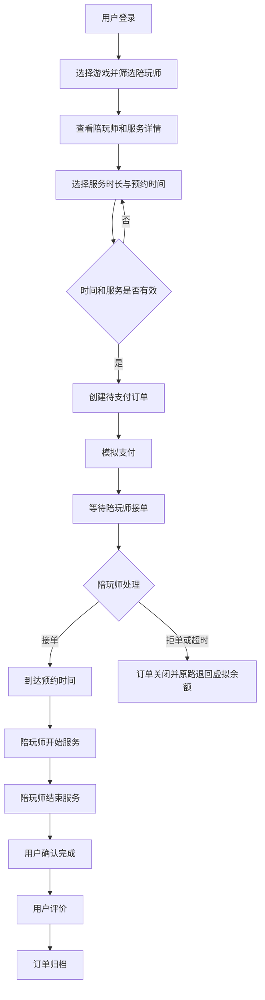
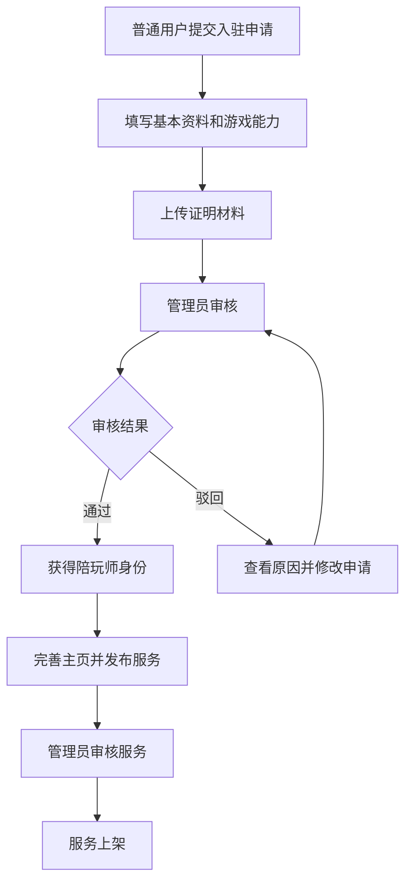
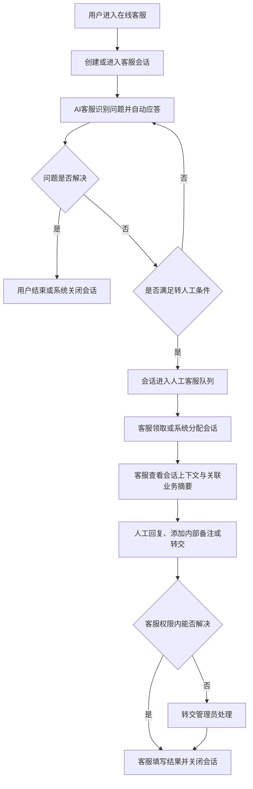

# 游戏陪玩系统需求分析说明书

> 文档版本：V1.1
> 产品形态：Web 端 B/S 系统
> 项目性质：软件工程专业本科毕业设计
> 当前阶段：需求分析
> 编写日期：2026 年 8 月 11 日

## 1. 项目概述

### 1.1 项目背景

随着网络游戏和线上娱乐的发展，玩家对开黑组队、游戏教学、娱乐陪伴等个性化服务的需求不断增加。传统的游戏群、论坛或社交平台约玩方式存在信息分散、服务能力难以验证、交易过程缺少保障、服务纠纷难以处理等问题。

本项目拟设计并实现一个基于 B/S 架构的游戏陪玩系统，通过连接普通玩家与游戏陪玩师，为玩家提供陪玩师浏览、服务预约、订单履约、评价投诉等功能，同时为陪玩师提供入驻申请、技能发布、订单处理和收益查询等功能。平台同时提供 AI 客服自动应答与人工客服接待能力，由管理员负责资质审核、客服账号发放、业务管理和纠纷处理。

### 1.2 建设目标

系统需要实现“寻找陪玩—预约下单—陪玩师接单—服务履约—确认完成—评价反馈”的完整业务闭环，主要目标如下：

1. 为普通玩家提供便捷、透明、可追踪的游戏陪玩预约渠道。
2. 为陪玩师提供展示游戏技能、管理服务项目和接受订单的平台。
3. 通过审核、评价、投诉和后台监管机制提高服务可信度。
4. 通过规范的订单状态和业务规则保证交易流程一致、可追溯。
5. 通过 AI 自动应答、必要时转人工的双轨客服机制提高咨询处理效率。
6. 构建功能完整、规模适中、可进行测试和论文展示的毕业设计系统。

### 1.3 产品定位

本系统定位为一个 **C2C 多游戏陪玩 Web 平台**，包括：

- 用户端：普通用户和陪玩师通过浏览器使用，并可进入在线客服；
- 客服工作台：人工客服通过独立工作台接待和处理会话；
- 管理端：管理员通过独立后台页面进行运营及客服账号管理；
- 服务范围：开黑陪伴、娱乐陪玩和游戏教学；
- 计费方式：首期采用按小时计费；
- 交易方式：毕业设计阶段采用模拟支付和平台虚拟余额，不接入真实支付、银行卡及提现接口。

### 1.4 默认业务假设

本需求分析基于以下默认假设，后续如有调整应同步修改系统设计：

1. 系统同时支持多个游戏，首批可配置《王者荣耀》《英雄联盟》《和平精英》等示例游戏。
2. 一个注册账号默认是普通用户，通过提交入驻申请并审核通过后可获得陪玩师身份。
3. 同一账号可同时具有普通用户和陪玩师身份，但同一订单中只能扮演一种角色。
4. 用户可以指定陪玩师及其服务项目创建预约订单，首期不实现智能匹配和抢单大厅。
5. 陪玩服务仅限双方共同进行游戏或教学，不允许代登录、索要账号密码、使用外挂或代练。
6. 陪玩师可自主设置服务价格，平台可配置允许的价格范围。
7. 系统通过站内消息完成重要业务通知，首期不接入短信、实时语音房和第三方即时通信服务。
8. 系统支持用户与平台客服之间的文本会话，但不支持普通用户与陪玩师之间的实时私信。
9. 人工客服是独立后台角色，其账号只能由管理员创建、启用、禁用和重置密码，不开放前台注册。
10. AI 客服优先依据平台知识库自动应答，无法可靠回答、命中敏感业务或用户主动要求时转接人工客服。

## 2. 需求范围

### 2.1 系统边界

系统负责：

- 用户账号及个人资料管理；
- 游戏和陪玩服务信息展示；
- 陪玩师入驻申请与资质审核；
- 服务项目发布、上下架与排期管理；
- 预约订单创建、模拟支付、接单及履约；
- 评价、投诉及管理员处理；
- 客服账号创建、启用、禁用和密码重置；
- 用户与 AI 客服、人工客服之间的文本咨询、转接和历史会话管理；
- AI 客服知识库、人工会话队列、内部备注和客服处理记录管理；
- 虚拟收益记录和业务数据统计；
- 后台基础数据、用户、陪玩师、订单和内容管理。

系统不直接负责：

- 游戏本身的运行、组队和对局数据生成；
- 游戏账号托管、代登录和代练；
- 真实资金托管、银行清算、开票和税务处理；
- 实时语音、视频、直播及屏幕共享；
- 游戏官方战绩接口和第三方实名接口；
- 线下见面陪玩服务。

### 2.2 首期不纳入范围

以下功能可作为后续扩展，不纳入毕业设计首期验收范围：

- AI 智能推荐和自动派单；
- 普通用户与陪玩师之间的实时私信、语音房、视频通话；客服文本会话不受此限制；
- 动态社区、短视频、直播和礼物打赏；
- 公会、战队和多人拼单；
- 会员、积分、优惠券和复杂营销活动；
- 真实支付、自动分账与真实提现；
- 自动同步游戏段位和战绩；
- 移动 App、微信小程序及多端同步。

## 3. 用户角色分析

| 角色 | 角色说明 | 核心诉求 | 主要权限 |
|---|---|---|---|
| 游客 | 未登录的访问者 | 了解平台和浏览服务 | 注册、登录、浏览公开游戏及陪玩师信息 |
| 普通用户 | 有陪玩需求的注册用户 | 找到合适的陪玩师并获得有保障的服务 | 搜索筛选、收藏、预约下单、模拟支付、取消订单、确认完成、评价、投诉 |
| 陪玩师 | 审核通过的服务提供者 | 展示能力、获得订单并查看收益 | 维护陪玩资料、发布服务、设置可约时间、接单/拒单、开始/结束服务、异常报备、收益查询 |
| 客服人员 | 由管理员后台创建的内部服务人员 | 解答咨询并跟进 AI 转人工会话 | 查看和回复授权会话、查看关联业务摘要、添加内部备注、转交管理员、关闭会话 |
| 管理员 | 平台管理人员 | 维护平台秩序并监管业务 | 用户管理、入驻审核、客服账号管理、游戏与服务类目管理、订单监管、投诉仲裁、评价管理、公告管理、统计分析 |

### 3.1 角色关系

- 游客注册后成为普通用户。
- 普通用户提交陪玩师申请，管理员审核通过后增加陪玩师身份。
- 陪玩师身份被暂停或取消后，该账号仍可保留普通用户能力，但不能发布服务或接受新订单。
- 客服账号不得通过前台注册，只能由管理员在后台创建和发放。
- 客服人员与普通用户、陪玩师身份相互独立，不具备管理员的审核、退款、资金调整、封禁和强制修改订单权限。
- 客服账号被禁用后应立即禁止登录并使已有登录会话失效；管理员可重新启用或重置其密码。
- 管理员账号由系统预置或其他管理员创建，不开放前台注册。

## 4. 核心业务流程

### 4.1 用户预约陪玩流程



### 4.2 陪玩师入驻流程



### 4.3 投诉处理流程

1. 用户从已支付的订单发起投诉，选择投诉类型并提交说明和证据。
2. 系统将订单标记为存在售后，相关虚拟收益暂时冻结。
3. 管理员查看订单、双方说明和相关证据。
4. 管理员作出维持订单、全额退款或部分退款的处理决定。
5. 系统同步调整订单、虚拟余额和陪玩师收益记录。
6. 双方可查看处理结果，投诉记录归档并保留操作日志。

### 4.4 AI 客服与人工客服协同流程



## 5. 功能需求分析

功能优先级说明：

- **P0**：核心功能，缺少时无法形成完整业务闭环；
- **P1**：重要功能，可明显改善完整性和用户体验；
- **P2**：扩展功能，可在核心功能完成后实现。

## 5.1 公共与账号功能

| 编号 | 功能 | 优先级 | 需求说明 |
|---|---|---:|---|
| FR-A01 | 用户注册 | P0 | 用户可使用用户名、手机号或邮箱及密码注册；用户名、手机号和邮箱应按设计要求校验唯一性 |
| FR-A02 | 用户登录/退出 | P0 | 用户输入账号和密码登录；退出后清除登录状态 |
| FR-A03 | 身份与权限控制 | P0 | 系统根据游客、普通用户、陪玩师、客服人员和管理员身份限制页面、数据与操作权限 |
| FR-A04 | 找回/修改密码 | P1 | 用户可通过身份验证重置密码，登录后可修改密码 |
| FR-A05 | 个人资料 | P0 | 用户可维护头像、昵称、性别、简介、常玩游戏等非敏感资料 |
| FR-A06 | 账号安全 | P1 | 支持查看最近登录时间、主动注销会话及账号注销申请 |
| FR-A07 | 站内通知 | P1 | 系统对申请审核、服务审核、订单状态、投诉结果等事件生成通知 |
| FR-A08 | 公告查看 | P1 | 用户可查看平台发布的规则、维护和活动公告 |

## 5.2 普通用户功能

### 5.2.1 游戏与陪玩师浏览

| 编号 | 功能 | 优先级 | 需求说明 |
|---|---|---:|---|
| FR-U01 | 游戏分类浏览 | P0 | 展示已启用的游戏、图标和简介，支持进入对应陪玩服务列表 |
| FR-U02 | 陪玩师列表 | P0 | 展示头像、昵称、认证状态、游戏、服务类型、价格、评分和接单量 |
| FR-U03 | 搜索与筛选 | P0 | 可按昵称关键词、游戏、服务类型、价格区间、评分和在线/可约状态筛选 |
| FR-U04 | 排序 | P1 | 支持按综合推荐、价格、评分和订单量排序 |
| FR-U05 | 陪玩师详情 | P0 | 查看个人简介、能力标签、段位证明、服务项目、可约时间及历史评价 |
| FR-U06 | 收藏 | P1 | 用户可收藏或取消收藏陪玩师，并查看收藏列表 |

### 5.2.2 预约与订单

| 编号 | 功能 | 优先级 | 需求说明 |
|---|---|---:|---|
| FR-U07 | 创建预约订单 | P0 | 选择服务项目、日期、开始时间和服务时长，填写游戏区服、游戏昵称及需求备注 |
| FR-U08 | 订单金额计算 | P0 | 系统依据服务单价和时长自动计算订单金额，并展示明细 |
| FR-U09 | 模拟支付 | P0 | 用户使用系统虚拟余额或模拟支付完成付款；支付操作应防止重复提交 |
| FR-U10 | 订单列表 | P0 | 按待支付、待接单、待服务、服务中、待确认、已完成、已关闭、售后中查询订单 |
| FR-U11 | 订单详情 | P0 | 展示订单编号、双方信息、服务内容、时间、金额、状态及状态变更记录 |
| FR-U12 | 取消订单 | P0 | 用户在满足取消规则时取消订单，系统记录原因并处理虚拟退款 |
| FR-U13 | 确认完成 | P0 | 陪玩师结束服务后，用户可确认完成；系统完成虚拟收益结算 |
| FR-U14 | 联系信息展示 | P1 | 仅在订单接单后向双方展示必要的游戏联系信息，避免公开泄露 |

### 5.2.3 评价与售后

| 编号 | 功能 | 优先级 | 需求说明 |
|---|---|---:|---|
| FR-U15 | 订单评价 | P0 | 完成订单后用户可提交 1～5 星评分、评价标签和文字内容；每个订单只能评价一次 |
| FR-U16 | 评价展示 | P0 | 已发布且未被屏蔽的评价显示在陪玩师详情页，并参与评分计算 |
| FR-U17 | 发起投诉 | P0 | 对符合条件的订单选择未履约、迟到、态度问题、服务不符或其他原因发起投诉 |
| FR-U18 | 上传证据 | P1 | 投诉可附文字说明和有限数量的图片证据 |
| FR-U19 | 售后进度 | P0 | 用户可查看投诉状态、管理员处理意见及退款结果 |
| FR-U20 | 举报内容 | P2 | 用户可举报陪玩师资料或不当评价，由管理员处理 |

## 5.3 陪玩师功能

### 5.3.1 入驻与资料管理

| 编号 | 功能 | 优先级 | 需求说明 |
|---|---|---:|---|
| FR-P01 | 入驻申请 | P0 | 普通用户填写真实姓名、联系方式、自我介绍和申请说明 |
| FR-P02 | 游戏能力认证 | P0 | 选择游戏、区服、段位、擅长位置等信息并上传证明图片 |
| FR-P03 | 申请状态查询 | P0 | 查看待审核、已通过、已驳回状态及驳回原因 |
| FR-P04 | 重新提交申请 | P0 | 被驳回后可修改资料并再次提交，保留历史审核信息 |
| FR-P05 | 陪玩主页维护 | P0 | 审核通过后维护展示昵称、介绍、游戏标签及服务说明 |
| FR-P06 | 服务状态设置 | P1 | 可将自身状态设为可接单、忙碌或休息；非可接单状态不接受新预约 |

### 5.3.2 服务项目与档期

| 编号 | 功能 | 优先级 | 需求说明 |
|---|---|---:|---|
| FR-P07 | 新增服务项目 | P0 | 选择游戏和服务类型，填写标题、介绍、按小时价格及最低服务时长 |
| FR-P08 | 编辑/上下架服务 | P0 | 可编辑未产生冲突的服务信息；下架后不影响已有订单，但不能产生新订单 |
| FR-P09 | 服务审核 | P0 | 新增或重要信息变更后进入待审核状态，审核通过才可公开展示 |
| FR-P10 | 可约时间设置 | P0 | 按日期或周期设置可服务时间，并可设置临时不可约时段 |
| FR-P11 | 时间冲突校验 | P0 | 已存在有效订单的时段不得重复接受预约 |

### 5.3.3 接单与履约

| 编号 | 功能 | 优先级 | 需求说明 |
|---|---|---:|---|
| FR-P12 | 新订单通知 | P1 | 用户支付后向陪玩师生成待处理通知 |
| FR-P13 | 接受订单 | P0 | 陪玩师在规定时间内确认接单，订单转为待服务 |
| FR-P14 | 拒绝订单 | P0 | 陪玩师填写原因后拒绝订单，订单关闭并退还用户虚拟余额 |
| FR-P15 | 开始服务 | P0 | 到达允许开始的时间窗口后，陪玩师可发起开始服务 |
| FR-P16 | 结束服务 | P0 | 服务达到约定条件后可结束服务，订单转为待用户确认 |
| FR-P17 | 异常报备 | P1 | 可对用户失联、服务器故障等情况提交说明，供售后处理参考 |
| FR-P18 | 订单记录 | P0 | 查看待处理、进行中和历史订单及订单详情 |
| FR-P19 | 收益明细 | P0 | 查看订单收入、冻结收益、已结算收益和退款扣减记录，不提供真实提现 |
| FR-P20 | 评价查看 | P1 | 查看用户评价和评分统计，但不能自行修改或删除评价 |

## 5.4 管理员功能

### 5.4.1 后台与用户管理

| 编号 | 功能 | 优先级 | 需求说明 |
|---|---|---:|---|
| FR-M01 | 管理员登录 | P0 | 管理后台使用独立入口，并验证管理员身份 |
| FR-M02 | 数据概览 | P1 | 展示用户数、陪玩师数、服务数、订单数、模拟交易额和待处理事项 |
| FR-M03 | 用户查询 | P0 | 按账号、昵称、手机号和状态查询用户及其基础资料 |
| FR-M04 | 用户状态管理 | P0 | 对违规用户执行启用、禁用等操作；禁用操作应记录原因 |
| FR-M05 | 陪玩师状态管理 | P0 | 可暂停或恢复陪玩师接单资格，并查看服务数据和违规记录 |

### 5.4.2 审核管理

| 编号 | 功能 | 优先级 | 需求说明 |
|---|---|---:|---|
| FR-M06 | 入驻申请审核 | P0 | 查看申请及证明材料，执行通过或驳回，驳回时必须填写原因 |
| FR-M07 | 服务项目审核 | P0 | 审核服务标题、说明、价格及游戏分类，处理通过或驳回 |
| FR-M08 | 评价管理 | P1 | 查询评价，对违法、辱骂、泄露隐私等内容进行屏蔽或恢复 |
| FR-M09 | 举报管理 | P2 | 查看用户举报并作出有效、无效及处罚处理 |

### 5.4.3 基础数据与内容管理

| 编号 | 功能 | 优先级 | 需求说明 |
|---|---|---:|---|
| FR-M10 | 游戏管理 | P0 | 新增、编辑、启用或停用游戏；停用后不允许创建新服务和订单 |
| FR-M11 | 服务类型管理 | P0 | 维护开黑陪伴、娱乐陪玩、游戏教学等服务类型 |
| FR-M12 | 标签管理 | P1 | 维护游戏位置、擅长英雄、风格等可配置标签 |
| FR-M13 | 公告管理 | P1 | 新增、编辑、发布、撤回和删除平台公告 |
| FR-M14 | 业务参数 | P1 | 配置价格范围、最低服务时长、接单超时时间和自动确认时间等参数 |

### 5.4.4 订单与投诉管理

| 编号 | 功能 | 优先级 | 需求说明 |
|---|---|---:|---|
| FR-M15 | 全部订单查询 | P0 | 按订单编号、用户、陪玩师、游戏、状态和时间范围查询订单 |
| FR-M16 | 订单详情与轨迹 | P0 | 查看订单信息、状态变更记录、模拟支付及退款记录 |
| FR-M17 | 异常订单处理 | P1 | 在保留原因和日志的前提下取消、关闭或完成异常订单 |
| FR-M18 | 投诉审核 | P0 | 查看双方信息和证据，执行维持订单、全额退款或部分退款 |
| FR-M19 | 虚拟资金调整 | P0 | 投诉处理结果自动生成余额和收益变动记录，不允许直接删除流水 |
| FR-M20 | 操作日志 | P1 | 记录管理员对用户、陪玩师、订单、投诉和配置的关键操作 |
| FR-M21 | 数据统计 | P1 | 按日期统计新增用户、有效订单、完成率、取消率、模拟交易额和热门游戏 |

## 5.5 客服功能

### 5.5.1 客服账号管理

| 编号 | 功能 | 优先级 | 需求说明 |
|---|---|---:|---|
| FR-C01 | 创建客服账号 | P0 | 管理员在后台填写账号、客服姓名、联系方式和初始密码创建客服账号；客服账号不得从前台注册 |
| FR-C02 | 客服账号查询 | P0 | 管理员可按账号、姓名、状态和创建时间查询客服账号 |
| FR-C03 | 启用/禁用客服账号 | P0 | 管理员可启用或禁用客服账号；禁用时必须填写原因，并立即禁止登录、终止已有登录会话和停止接收新咨询 |
| FR-C04 | 重置客服密码 | P0 | 管理员可将客服密码重置为临时密码；密码重置后原登录会话失效，客服下次登录必须修改临时密码 |
| FR-C05 | 账号操作日志 | P1 | 系统记录客服账号创建、启用、禁用和密码重置操作的管理员、时间、对象及原因 |
| FR-C06 | 客服工作状态 | P1 | 客服可设置在线、忙碌或离线；仅在线且未达到接待上限的客服可以接收新会话 |

### 5.5.2 用户端客服

| 编号 | 功能 | 优先级 | 需求说明 |
|---|---|---:|---|
| FR-C07 | 发起客服咨询 | P0 | 登录用户可从帮助中心、个人中心或订单详情发起客服会话 |
| FR-C08 | 文本消息收发 | P0 | 用户可在客服会话中发送和接收文本消息；首期不支持客服会话中的图片、文件、语音和视频 |
| FR-C09 | AI 自动应答 | P0 | 新会话默认由 AI 客服接待，结合平台知识库、当前会话上下文和用户主动关联的业务摘要自动回答 |
| FR-C10 | 主动转人工 | P0 | 用户可随时申请人工客服，系统说明排队状态并将完整会话上下文转入人工队列 |
| FR-C11 | 自动转人工 | P0 | AI 命中转人工条件时自动提示用户并转入人工队列，不得继续猜测或承诺处理结果 |
| FR-C12 | 会话状态查看 | P1 | 用户可查看 AI 处理中、等待人工、人工处理中、已转交管理员和已关闭等状态 |
| FR-C13 | 关联订单咨询 | P0 | 用户从订单详情发起咨询时，系统自动关联订单编号和必要摘要，不向 AI 或客服提供超出业务需要的数据 |
| FR-C14 | 历史会话查询 | P1 | 用户只能查询本人历史客服会话、公开回复和处理结果，不能看到内部备注 |
| FR-C15 | 客服服务评价 | P2 | 用户可对已关闭的人工客服会话提交满意度评分和意见，每个会话最多评价一次 |

### 5.5.3 AI 客服

| 编号 | 功能 | 优先级 | 需求说明 |
|---|---|---:|---|
| FR-C16 | 常见问题回答 | P0 | AI 客服可回答注册登录、服务预约、订单状态、取消规则、评价投诉和平台规范等常见问题 |
| FR-C17 | 知识库检索 | P0 | AI 应优先使用管理员审核生效的知识库内容生成回答，并在未找到可靠依据时转人工 |
| FR-C18 | 上下文识别 | P1 | AI 可使用当前会话历史及当前用户主动关联的订单摘要理解追问，但不得跨用户、跨会话读取未授权信息 |
| FR-C19 | 转人工判断 | P0 | AI 根据用户主动请求、低置信度、连续未解决、敏感业务、风险内容或服务异常等条件决定转人工 |
| FR-C20 | 回答权限边界 | P0 | AI 只能解释规则和引导操作，不得执行或承诺退款、改单、余额调整、解封、审核及投诉仲裁 |
| FR-C21 | AI 身份标识 | P0 | AI 生成的每条回复必须明确标识为“AI 客服”，不得使用户误认为人工回复 |
| FR-C22 | 异常降级 | P0 | AI 服务超时、不可用或返回异常时，系统提示当前状态，并提供知识库固定答案和转人工入口 |
| FR-C23 | 知识库管理 | P1 | 管理员可按分类新增、编辑、启用、停用常见问题及标准答案，并记录维护信息 |

### 5.5.4 人工客服工作台

| 编号 | 功能 | 优先级 | 需求说明 |
|---|---|---:|---|
| FR-C24 | 人工会话队列 | P0 | 客服可查看等待人工处理的会话主题、来源、优先级和排队时长 |
| FR-C25 | 领取/分配会话 | P0 | 在线客服可领取待接会话，管理员也可分配或转交会话；同一时刻最多一名客服负责一个会话 |
| FR-C26 | 人工回复 | P0 | 客服可回复已分配给自己的会话，并查看 AI 阶段的完整会话上下文 |
| FR-C27 | 关联信息与内部备注 | P1 | 客服可查看脱敏的用户及关联订单摘要并添加仅内部可见的处理备注 |
| FR-C28 | 转交管理员 | P0 | 遇到退款、投诉仲裁、封禁申诉、异常订单或其他超权限事项时，客服可填写说明并转交管理员 |
| FR-C29 | 关闭与查询会话 | P0 | 客服可填写处理分类和结果后关闭会话，并只能查询本人接待、获授权或当前被分配的会话记录 |

## 6. 核心用例说明

### 6.1 UC-01 用户预约陪玩

| 项目 | 内容 |
|---|---|
| 主要参与者 | 普通用户 |
| 前置条件 | 用户已登录；陪玩师和服务项目处于可用状态；所选时间可预约 |
| 触发条件 | 用户在服务详情页点击“立即预约” |
| 基本流程 | 选择日期、时间和时长 → 填写游戏信息及备注 → 系统校验档期和金额 → 创建订单 → 用户完成模拟支付 → 系统通知陪玩师 |
| 备选流程 | 余额不足则支付失败；档期冲突则要求重新选择；重复提交只保留一个有效支付结果 |
| 后置条件 | 订单进入“待接单”，对应时段被临时占用 |

### 6.2 UC-02 陪玩师处理订单

| 项目 | 内容 |
|---|---|
| 主要参与者 | 陪玩师 |
| 前置条件 | 陪玩师身份正常；存在已支付的待接单订单 |
| 触发条件 | 陪玩师打开待处理订单 |
| 基本流程 | 查看订单 → 确认时间与需求 → 接受订单 → 系统将订单转为“待服务”并锁定档期 |
| 备选流程 | 陪玩师填写原因拒绝；超过处理时限未响应则系统自动关闭订单 |
| 后置条件 | 接单后双方可查看必要联系信息；拒绝或超时后用户获得虚拟退款 |

### 6.3 UC-03 完成陪玩服务

| 项目 | 内容 |
|---|---|
| 主要参与者 | 陪玩师、普通用户 |
| 前置条件 | 订单为待服务状态且进入允许开始的时间范围 |
| 触发条件 | 陪玩师点击“开始服务” |
| 基本流程 | 陪玩师开始服务 → 系统记录开始时间 → 陪玩师结束服务 → 用户确认完成 → 系统结算虚拟收益 |
| 备选流程 | 用户未及时确认则系统到期自动确认；发生争议时用户发起投诉并冻结结算 |
| 后置条件 | 无售后时订单进入“已完成”，用户可评价 |

### 6.4 UC-04 管理员审核陪玩师

| 项目 | 内容 |
|---|---|
| 主要参与者 | 管理员 |
| 前置条件 | 用户已提交完整的入驻申请 |
| 触发条件 | 管理员进入待审核申请详情 |
| 基本流程 | 查看资料和证明 → 审核通过 → 系统授予陪玩师身份 → 发送审核通知 |
| 备选流程 | 资料不完整或不符合规则时驳回，并填写明确原因 |
| 后置条件 | 通过后用户可创建陪玩服务；驳回后可修改并重新提交 |

### 6.5 UC-05 管理员处理投诉

| 项目 | 内容 |
|---|---|
| 主要参与者 | 管理员 |
| 前置条件 | 存在待处理投诉，订单及相关证据可查询 |
| 触发条件 | 管理员打开投诉详情 |
| 基本流程 | 查看订单和证据 → 核实双方说明 → 选择处理方案 → 填写处理意见 → 系统调整订单与虚拟资金 → 通知双方 |
| 备选流程 | 证据不足时可要求补充材料；重复处理请求不得重复退款 |
| 后置条件 | 投诉进入已处理状态，结果和管理员操作被记录 |

### 6.6 UC-06 用户咨询 AI 客服并转人工

| 项目 | 内容 |
|---|---|
| 主要参与者 | 普通用户或陪玩师、AI 客服、客服人员 |
| 前置条件 | 用户已登录；客服模块可用 |
| 触发条件 | 用户从帮助中心、个人中心或订单详情进入在线客服并发送问题 |
| 基本流程 | 系统创建会话 → AI 根据知识库和当前上下文回答 → AI 判断无法可靠解决或用户主动要求人工 → 会话携带上下文进入人工队列 → 客服领取会话并回复 → 客服记录结果并关闭会话 |
| 备选流程 | AI 服务异常时展示固定提示并直接提供转人工入口；无人工在线时保留排队会话；超权限事项由客服转交管理员 |
| 后置条件 | 会话、消息、转接轨迹和处理结果被保存；用户可查询公开记录 |

### 6.7 UC-07 管理员发放和管理客服账号

| 项目 | 内容 |
|---|---|
| 主要参与者 | 管理员 |
| 前置条件 | 管理员已登录且具有客服账号管理权限 |
| 触发条件 | 管理员进入客服账号管理页面 |
| 基本流程 | 创建客服账号并设置临时密码 → 系统记录操作 → 客服首次登录并强制修改密码；管理员后续可查询、启用、禁用或重置密码 |
| 备选流程 | 账号重复、密码不符合规则或字段不完整时拒绝创建；禁用和重置密码后立即使原会话失效 |
| 后置条件 | 客服账号状态和凭据按操作更新，完整审计日志被保留 |

### 6.8 UC-08 人工客服处理会话

| 项目 | 内容 |
|---|---|
| 主要参与者 | 客服人员 |
| 前置条件 | 客服账号正常、已完成首次改密并处于在线状态；存在等待人工的会话 |
| 触发条件 | 客服领取或管理员分配会话 |
| 基本流程 | 查看 AI 会话上下文和脱敏业务摘要 → 回复用户 → 添加内部备注 → 填写处理分类和结果 → 关闭会话 |
| 备选流程 | 需要退款、仲裁、账户处罚或异常订单处理时，填写说明并转交管理员；暂时无法解决时保持人工处理中 |
| 后置条件 | 用户收到处理结果；会话、消息、备注和操作轨迹被保存 |

## 7. 业务规则

### 7.1 账号与权限规则

1. 用户必须登录后才能预约、收藏、申请陪玩师或提交评价投诉。
2. 被禁用账号不能登录；已登录会话应失效。
3. 陪玩师只有在入驻申请通过且状态正常时才能发布服务和接受订单。
4. 用户不得预约自己发布的服务。
5. 管理员关键操作必须记录操作人、时间、对象、前后状态及原因。

### 7.2 服务与档期规则

1. 服务项目必须关联一个已启用游戏和一个已启用服务类型。
2. 服务价格必须在平台配置的最低价和最高价范围内。
3. 服务时长以 0.5 小时为递增单位，默认最低 1 小时。
4. 服务项目经管理员审核通过并上架后才能被预约。
5. 同一陪玩师在时间重叠的情况下只能存在一个待服务或服务中的有效订单。
6. 下架服务不影响已支付订单的履约，但不能创建新订单。

### 7.3 订单状态规则

建议订单状态机如下：

```text
待支付 → 待接单 → 待服务 → 服务中 → 待确认 → 已完成
   │         │         │         │         │
   └─────────┴─────────┴─────────┴─────────┴→ 已关闭
                       └──────────────→ 售后中 → 已完成/已关闭
```

状态定义：

| 状态 | 含义 | 允许的主要操作 |
|---|---|---|
| 待支付 | 订单已创建但未完成模拟支付 | 支付、用户取消、超时关闭 |
| 待接单 | 已支付，等待陪玩师确认 | 陪玩师接单/拒绝、用户按规则取消、超时关闭 |
| 待服务 | 陪玩师已接单，等待预约时间 | 用户申请取消、陪玩师开始服务、异常处理 |
| 服务中 | 陪玩师已开始履约 | 陪玩师结束服务、双方异常报备 |
| 待确认 | 陪玩师已结束，等待用户确认 | 用户确认完成、用户投诉、超时自动确认 |
| 售后中 | 投诉或退款正在处理 | 管理员仲裁，普通业务状态暂时冻结 |
| 已完成 | 服务正常完成并结算 | 用户评价、在时限内投诉 |
| 已关闭 | 未支付、拒单、取消或退款后结束 | 查看详情，不允许继续履约 |

### 7.4 订单时间与取消规则

1. 待支付订单默认 15 分钟未支付自动关闭。
2. 陪玩师默认应在支付后 30 分钟内接单；超过时限自动关闭并退回虚拟余额。
3. 距预约开始时间 2 小时以上，用户可无责取消并全额退回虚拟余额。
4. 距开始时间不足 2 小时，原则上需发起取消申请；首期可由管理员决定退款比例。
5. 陪玩师拒单或超时未接单时，订单全额退款且不计入用户责任。
6. 陪玩师结束服务后，用户 24 小时未操作且未投诉，系统自动确认完成。
7. 已完成订单默认在 72 小时内允许发起投诉，超过时限只能举报，不能退款。

### 7.5 模拟资金与收益规则

1. 系统只记录虚拟余额和模拟交易，不代表真实货币支付。
2. 模拟支付成功后扣减用户余额，订单关闭或退款时按结果返还。
3. 订单确认完成后，订单金额计入陪玩师已结算虚拟收益。
4. 售后中的订单收益被冻结，仲裁完成后根据退款金额重新计算。
5. 所有余额变动必须生成不可直接删除的流水记录。
6. 同一支付、退款或结算请求必须保证幂等，不能重复扣款或重复入账。

### 7.6 评价与投诉规则

1. 只有订单实际下单用户可以评价对应陪玩师。
2. 一个订单只能提交一次主评价，首期不支持修改和追评。
3. 陪玩师综合评分取所有未屏蔽有效评价的平均值，保留一位小数。
4. 评价不得包含辱骂、广告、联系方式或他人隐私，管理员可屏蔽但应保留原始记录。
5. 投诉必须关联订单，并选择投诉原因、填写事实说明。
6. 管理员处理退款必须填写处理意见；处理动作应具备防重复机制。

### 7.7 合规与安全规则

1. 明确禁止代登录、索要游戏账号密码、代练、外挂、赌博、色情低俗、诈骗和线下非法交易。
2. 页面应提示用户不要泄露密码、验证码和敏感个人信息。
3. 昵称、简介、服务内容、评价和投诉材料需要进行长度、类型及敏感词校验。
4. 为降低毕业设计的真实合规风险，系统不接入真实支付、提现、实时语音及未成年人充值业务。
5. 若后续投入真实运营，必须补充实名认证、未成年人保护、内容审核、支付持牌机构对接、隐私政策及相关服务协议。

### 7.8 客服账号与权限规则

1. 客服账号只能由管理员在后台创建，不允许前台注册、普通用户转化或客服自行创建。
2. 管理员创建客服账号时设置临时密码；客服首次登录必须修改临时密码后才能进入工作台。
3. 管理员可启用、禁用和重置客服账号密码，禁用和重置密码应立即使该账号已有登录会话失效。
4. 客服只能查看当前分配、本人接待或管理员明确授权的会话，以及与会话直接关联的脱敏业务摘要。
5. 客服只能咨询答复、添加内部备注、关闭会话和转交管理员，不得执行退款、资金调整、订单强制变更、陪玩师审核、投诉仲裁及账号封禁或解封。
6. 客服账号管理、登录、会话领取、转交、关闭和内部备注等关键行为必须记录审计日志。

### 7.9 客服会话状态与转人工规则

建议客服会话状态机如下：

```text
AI 处理中 → 等待人工 → 人工处理中 → 已关闭
     │           │            │
     └───────────┴────────────┴→ 已转交管理员 → 已关闭
```

| 状态 | 含义 | 允许的主要操作 |
|---|---|---|
| AI 处理中 | AI 客服正在接待 | 用户继续提问、申请人工；AI 回答或触发转人工 |
| 等待人工 | 会话进入人工队列但尚未分配 | 用户继续补充信息；客服领取或管理员分配 |
| 人工处理中 | 已由一名客服负责 | 双方发送消息；客服添加备注、转交管理员或关闭 |
| 已转交管理员 | 事项超出客服权限，等待管理员处理 | 管理员查看和处理；客服及用户查看公开进度 |
| 已关闭 | 咨询处理结束 | 查看历史和评价；再次咨询时创建新会话 |

满足以下任一条件时，系统应提供或自动执行转人工：

1. 用户明确输入或点击“转人工客服”。
2. AI 未命中可靠知识，回答置信度低于系统配置阈值。
3. 用户连续两次表示答案无效或问题仍未解决。
4. 问题涉及退款、投诉仲裁、账号异常、封禁申诉、订单争议、虚拟资金或其他敏感业务。
5. 内容涉及诈骗、威胁、人身安全、严重辱骂等风险情形。
6. AI 服务超时、不可用或返回异常。

其他会话规则：

1. 新客服会话默认进入 AI 处理中，AI 回复必须显著标识“AI 客服”。
2. 转人工时必须完整传递当前会话消息及用户主动关联的订单摘要，避免用户重复描述。
3. 一个会话任一时刻最多由一名人工客服负责；转交时须生成分配记录。
4. 已关闭会话默认禁止继续发送消息；用户再次咨询时创建新会话。
5. 客服全离线时，会话保留在等待人工队列，系统应向用户说明当前无在线客服。
6. 用户可见消息、内部备注和系统审计信息必须严格隔离，内部备注不得返回用户端。

### 7.10 AI 客服规则

1. AI 客服优先检索管理员维护且已启用的知识库，再结合当前会话上下文生成回答。
2. AI 仅能解释平台规则、回答常见问题、说明当前用户主动关联订单的状态，并引导用户执行已有前台操作。
3. AI 不得执行或承诺退款、改单、余额调整、解封、审核和投诉仲裁，不得编造未从系统取得的业务状态。
4. AI 不得跨用户、跨会话访问数据，也不得展示用户密码、完整联系方式等敏感信息。
5. AI 无法确认答案时应明确说明并转人工，不得以猜测内容继续回答。
6. 外部 AI 服务不可用不得阻塞注册、下单、支付和履约等核心业务；系统应降级为固定知识库回答及人工转接。

## 8. 非功能需求

### 8.1 性能需求

| 编号 | 需求指标 |
|---|---|
| NFR-P01 | 在毕业设计部署环境下支持不少于 100 个并发在线会话 |
| NFR-P02 | 普通列表和详情查询在正常负载下 95% 请求响应时间不超过 2 秒 |
| NFR-P03 | 登录、创建订单、支付和状态变更操作在正常负载下 95% 请求响应时间不超过 3 秒 |
| NFR-P04 | 陪玩师列表应支持分页查询，单页默认不超过 20 条 |
| NFR-P05 | 图片上传应限制类型和大小，单张建议不超过 5 MB |
| NFR-P06 | AI 客服正常可用时，首次应答目标为 5 秒内返回；超过 10 秒应提示异常并提供转人工入口 |
| NFR-P07 | 人工客服消息在连接正常时应及时送达；断线重连后可重新拉取未读消息和会话状态 |

### 8.2 安全需求

1. 用户密码必须采用带盐的强哈希算法存储，不得明文保存或返回。
2. 登录接口应进行频率限制，连续失败达到阈值后短暂锁定或要求验证。
3. 后端必须执行身份认证和权限校验，不能仅依靠前端隐藏按钮。
4. 所有输入必须进行合法性校验，防范 SQL 注入、XSS、越权访问和恶意文件上传。
5. 敏感联系方式默认脱敏展示，仅在业务需要且符合权限时显示。
6. 订单、余额、审核和投诉等关键写操作需要事务控制和操作日志。
7. 文件上传只允许白名单类型，重命名存储并禁止作为脚本执行。
8. 用户不得通过篡改会话编号访问他人的客服会话，客服不得访问未分配或未授权的会话。
9. 客服界面中的手机号、邮箱等敏感信息应按业务需要脱敏展示。
10. 客服消息应设置长度和发送频率限制，并进行 XSS 与敏感内容校验。
11. AI 请求只传递回答当前问题所必需的最少信息，不传递密码、验证码等高敏感数据。

### 8.3 可靠性需求

1. 订单状态变更必须满足状态机约束，非法状态跳转应被拒绝。
2. 创建订单、模拟支付、退款和结算操作应保证数据一致性与幂等性。
3. 数据库操作失败时应回滚，不得形成“余额已扣但订单未支付”等中间状态。
4. 系统异常应返回明确但不过度暴露内部信息的错误提示。
5. 应制定数据库备份方案，毕业设计演示数据至少支持手工备份和恢复。
6. 客服会话和消息发送应具备唯一标识，断线重试不得产生重复消息。
7. AI 服务故障应自动降级，不得影响登录、下单、支付和订单履约等核心业务。

### 8.4 易用性需求

1. 用户端和管理端布局清晰，主要操作路径不超过合理层级。
2. 表单必填项、格式要求和错误原因应明确提示。
3. 订单状态使用统一文字和颜色表达，并提供下一步可执行操作。
4. 关键操作，如取消订单、拒绝申请、退款和禁用账号，应进行二次确认。
5. Web 页面应适配常见桌面分辨率，并在现代浏览器中正常使用。
6. 用户应能明确区分 AI 客服与人工客服，并随时看到当前会话和排队状态。

### 8.5 可维护性与可扩展性需求

1. 系统应按用户、陪玩师、服务、订单、评价投诉、客服和后台管理等业务模块划分。
2. 游戏、服务类型、标签和主要业务参数应配置化，不应硬编码在页面中。
3. 数据表、接口和业务状态应采用统一命名规范。
4. 关键业务应具备必要日志，便于定位订单状态和权限问题。
5. 客服文本会话与普通用户、陪玩师私信能力应保持模块隔离，并为后续扩展更多消息类型预留边界。
6. AI 客服应通过独立服务接口接入，便于替换模型、知识检索方案或切换到降级策略。

### 8.6 兼容性需求

1. 支持近期版本的 Chrome、Edge 等 Chromium 内核浏览器。
2. 前后端通过标准 HTTP/HTTPS 接口通信。
3. 系统使用 UTF-8 编码，正确处理中文昵称、简介和评价。
4. 部署环境应能在普通个人计算机或云服务器上运行，便于答辩演示。

## 9. 数据需求概述

需求分析阶段预计包含以下核心业务实体，详细字段将在数据库设计阶段确定：

| 实体 | 主要用途 |
|---|---|
| 用户 | 保存账号、身份、状态和基本资料 |
| 角色/权限 | 控制普通用户、陪玩师、客服人员和管理员权限 |
| 陪玩师申请 | 保存入驻资料、证明和审核结果 |
| 陪玩师资料 | 保存公开主页、认证状态及综合评分 |
| 游戏 | 保存游戏分类和启停状态 |
| 服务类型 | 保存开黑陪伴、娱乐陪玩、游戏教学等分类 |
| 陪玩服务 | 保存陪玩师发布的游戏、介绍、价格和上下架状态 |
| 可约时段 | 保存陪玩师可接受预约的时间范围 |
| 订单 | 保存预约双方、服务内容、时间、金额和当前状态 |
| 订单状态记录 | 保存订单完整状态变化轨迹 |
| 模拟资金流水 | 保存支付、退款、结算和调整记录 |
| 评价 | 保存订单评分、标签、内容及展示状态 |
| 投诉 | 保存投诉原因、证据、处理结果及退款信息 |
| 收藏 | 保存用户与陪玩师的收藏关系 |
| 通知 | 保存系统发送给用户的业务消息 |
| 公告 | 保存平台公告内容和发布状态 |
| 管理操作日志 | 保存管理员关键操作及审计信息 |
| 客服账号 | 保存客服人员身份、账号状态、首次改密状态和当前工作状态 |
| 客服会话 | 保存发起用户、来源、当前接待模式、状态、关联订单、当前客服及起止时间 |
| 客服消息 | 保存会话消息发送方、内容、发送时间和 AI/人工/系统消息标识 |
| 客服会话分配记录 | 保存 AI 转人工、客服领取、客服间转交及管理员分配轨迹 |
| 客服内部备注 | 保存客服或管理员的内部处理说明，用户不可见 |
| AI 知识库条目 | 保存问题分类、关键词、标准答案、生效状态和维护信息 |
| 客服服务评价 | 保存用户对已关闭人工客服会话的满意度及反馈 |

关键数据约束：

1. 用户账号标识应唯一。
2. 一个用户同一时刻只能有一个有效的陪玩师入驻审核申请。
3. 每个服务项目必须属于一个陪玩师、一个游戏和一个服务类型。
4. 每个订单必须保存下单时的服务名称、单价等快照，避免后续修改服务影响历史订单。
5. 一个订单最多存在一个有效评价和一个进行中的投诉。
6. 资金流水必须关联业务单据，并通过业务流水号保证唯一性。
7. 重要业务数据原则上采用状态停用或逻辑删除，不直接物理删除。
8. 一条客服会话只属于一个发起用户，一个会话任一时刻最多有一名当前人工客服。
9. 客服消息、分配轨迹和内部备注原则上不物理删除；内部备注不得通过用户端接口返回。
10. 已关闭会话默认不能继续发送消息，用户再次咨询时应创建新会话。
11. 客服账号名称应唯一；禁用状态、首次改密状态和密码重置时间应可追踪。
12. AI 调用记录和普通运行日志不得保存密码、验证码及不必要的完整个人信息。

## 10. MVP 范围与迭代建议

### 10.1 第一阶段：P0 核心闭环

1. 注册、登录、个人资料和角色鉴权。
2. 游戏、服务类型和陪玩师展示。
3. 陪玩师申请及管理员审核。
4. 服务项目发布、审核、上下架和可约时间管理。
5. 用户预约、模拟支付、订单查询与取消。
6. 陪玩师接单、拒单、开始服务和结束服务。
7. 用户确认完成、评价和投诉。
8. 管理员用户管理、订单监管和投诉处理。
9. 虚拟余额、退款和陪玩师收益流水。
10. 管理员创建、禁用、启用和重置客服账号密码。
11. 用户发起文本咨询、AI 自动应答、主动或自动转人工及人工客服处理会话。
12. AI 异常降级、客服越权限制和客服会话记录留存。

### 10.2 第二阶段：P1 完善体验

1. 收藏、公告和站内通知。
2. 排序、更多筛选条件及首页推荐。
3. 异常报备、评价管理和后台操作日志。
4. 数据看板和多维统计。
5. 账号安全、找回密码及更完善的风控限制。
6. AI 知识库后台维护、客服工作状态、内部备注和历史会话查询。
7. 客服会话分配、管理员转交及关联订单摘要。

### 10.3 第三阶段：P2 扩展能力

1. 举报处理和更多内容治理。
2. 智能推荐、自动匹配和抢单大厅。
3. 普通用户与陪玩师实时私信、语音房和推送。
4. 会员、优惠券、积分和营销活动。
5. 第三方实名认证、真实支付及提现。
6. 客服满意度评价、质检报表以及图片和文件消息。

## 11. 验收标准

系统满足以下条件时，可认为首期核心需求验收通过：

1. 游客可浏览公开信息，注册用户可正常登录并维护资料。
2. 普通用户能提交陪玩师申请，管理员可通过或驳回，权限随审核结果正确变化。
3. 陪玩师可发布服务并设置可约时间，管理员审核通过后服务可被用户检索。
4. 用户可选择服务和时间创建订单，系统能发现无效时段及档期冲突。
5. 模拟支付成功后订单进入待接单，重复提交不会重复扣减余额。
6. 陪玩师可接单或拒单，并按顺序执行开始、结束服务操作。
7. 用户确认完成后，订单状态、用户余额和陪玩师虚拟收益保持一致。
8. 用户可对完成订单评价，陪玩师详情页评分能正确更新。
9. 用户可发起投诉，管理员可作出维持订单、全额退款或部分退款处理。
10. 非法越权、非法状态跳转、重复退款和重复结算请求能被系统拒绝。
11. 管理员可查询和管理用户、陪玩师、游戏、服务、订单、评价及投诉。
12. 核心功能具有测试用例，主要业务流程可在答辩环境中完整演示。
13. 管理员可创建、启用、禁用客服账号及重置密码；禁用或重置后原登录会话立即失效，临时密码首次登录必须修改。
14. 用户发起咨询后 AI 客服能以明确身份标识自动应答；用户主动要求、AI 无法可靠回答或命中敏感事项时，会话能携带上下文转入人工队列。
15. 人工客服可领取或接收分配的会话、继续回复、添加内部备注、转交管理员并关闭会话，用户端不能看到内部备注。
16. 客服和 AI 尝试退款、调整余额、强制修改订单、封禁账号或访问未授权会话时，后端能够拒绝操作。
17. AI 服务异常时系统能提示用户并降级到固定知识库回答或人工转接，订单核心流程不受影响。

## 12. 需求风险与应对措施

| 风险 | 影响 | 应对措施 |
|---|---|---|
| 功能范围过大 | 无法按时完成开发与测试 | 优先实现 P0，只在核心闭环稳定后开发 P1/P2 |
| 订单状态复杂 | 易出现非法跳转和数据不一致 | 建立统一状态机，关键操作使用事务和状态前置校验 |
| 真实支付接入成本高 | 涉及资质、安全及外部依赖 | 毕业设计使用模拟支付和虚拟资金流水 |
| 陪玩行业合规风险 | 涉及未成年人、低俗内容和代练 | 明确禁止项，加入审核、举报、投诉和敏感内容治理 |
| 实时通信开发难度高 | 增加开发周期和部署成本 | 首期使用站内通知和游戏内联系信息，不实现语音房 |
| 游戏数据接口不可用 | 无法自动核验段位和战绩 | 首期采用证明图片加管理员人工审核 |
| 恶意取消或虚假投诉 | 损害交易双方权益 | 设置取消时限、证据提交、管理员仲裁和操作日志 |
| AI 幻觉或错误回答 | 误导用户并引发投诉 | 采用审核知识库优先、能力边界限制、低置信度和敏感问题强制转人工 |
| AI 服务不可用或响应超时 | 用户无法及时获得自动回复 | 提供固定问答降级、异常提示和人工客服转接，不阻塞订单主流程 |
| 客服越权访问数据 | 造成隐私泄露和业务风险 | 按会话授权、敏感数据脱敏、后端权限校验和完整操作审计 |
| 客服账号被滥用 | 非法查看或泄露会话信息 | 账号由管理员发放、首次强制改密、禁用踢下线并记录登录及操作日志 |
| 人工会话积压 | 等待时间过长，影响用户体验 | 设置在线状态、接待上限、排队提示和管理员分配机制 |

## 13. 后续设计输入

本需求分析确认后，下一阶段应依次完成：

1. 系统用例图和核心用例规约；
2. 系统功能结构图；
3. 订单、审核、投诉及 AI 转人工业务流程图；
4. 系统总体架构设计与技术选型；
5. 数据库 E-R 图和详细表结构；
6. 前后台页面清单及低保真原型；
7. 接口设计、角色权限矩阵、订单状态机和客服会话状态机实现方案；
8. 客服文本消息通信、断线重连和消息可靠投递方案；
9. AI 客服知识检索、回答边界、置信度阈值、降级和转人工策略；
10. 测试计划与核心功能测试用例。

## 14. 待确认事项

以下内容当前使用默认方案，进入详细设计前建议最终确认：

- [ ] 是否保留“一个账号可同时作为用户和陪玩师”的设定；
- [ ] 首批演示游戏及每个游戏需要维护的区服、段位和位置字段；
- [ ] 是否只采用按小时计费，还是增加按局计费；
- [ ] 是否需要普通用户与陪玩师站内私信，或仅在接单后展示游戏联系方式；客服文本会话已确定实现；
- [ ] 模拟支付采用系统赠送余额，还是仅模拟支付结果；
- [ ] 订单取消时限、接单超时和自动确认时间是否采用本文默认值；
- [x] 客服作为独立角色，账号由管理员后台创建、禁用和重置密码，且不具备退款、资金调整、审核、仲裁和封禁权限；
- [ ] 是否需要在首期实现敏感词库和图片证据上传。
- [ ] AI 客服采用本地模型还是外部大模型 API；默认采用“审核知识库检索优先、模型增强回答、失败转人工”的可替换方案；
- [ ] 客服文本消息采用短轮询还是 WebSocket；默认建议 WebSocket，并保留断线后历史消息补拉能力；
- [ ] 人工客服每日服务时间、单客服并发接待上限和无客服在线时的排队提示文案。
